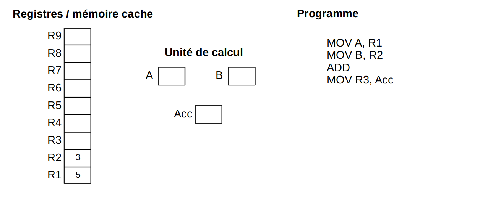
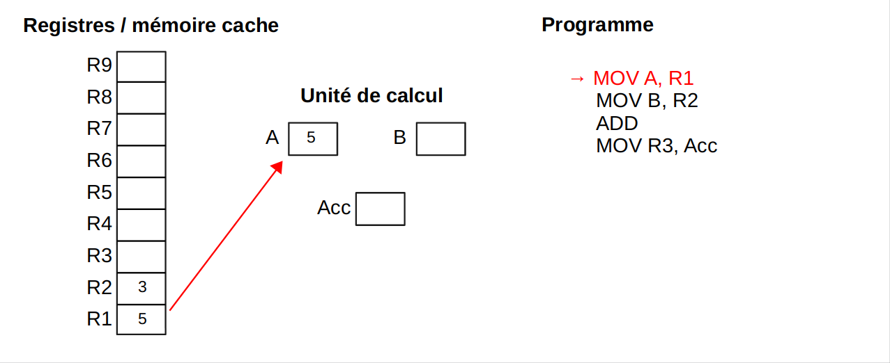
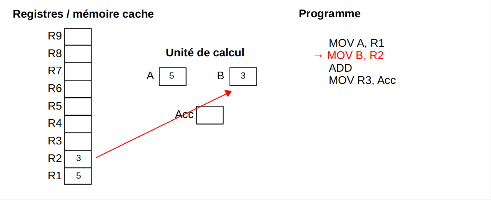
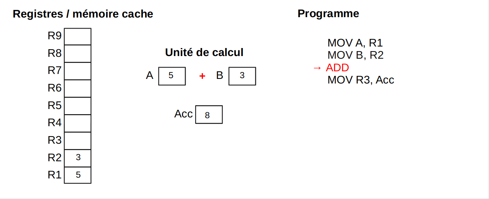
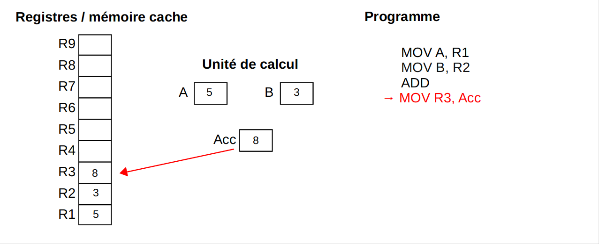
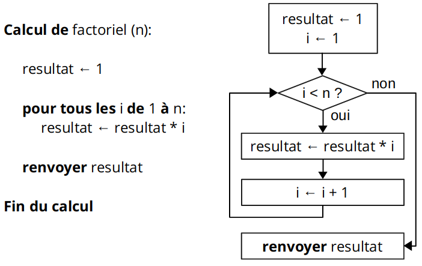

title: Initiation à la programmation
class: animation-fade
layout: true

<!-- This slide will serve as the base layout for all your slides -->
<!--
.bottom-bar[
  {{title}}
]
-->

---

class: impact

# {{title}}

---

# 0. Programmation et langage

## La programmation ...

- Écrire "du code" qui va être executé par un ordinateur

- Se fait au moyen d'un langage de programmation

- La programmation est *une étape* dans le processus de développement de logiciels (parmis la conception, l'écriture du cahiers des charges, la gestion des versions, la validation, ...)

---

# 0. Programmation et langage

## "Rappel" : Fonctionnement du processeur

- Une horloge qui déclenche des opérations
- Des unités de calcul (arithmetique et à nombre flottant)
- Des registres qui contiennent des données
- Une suite d'instructions machines à effectuer

---

# 0. Programmation et langage

## Assembleur vs. code machine

.col-4[
```text
MOV A, R1  
MOV B, R2  
ADD        
MOV R3, Acc
```
]

.col-2[
&nbsp;
]

.col-6[
```text
00010110 11000000 00110000  
00010110 11000001 00110001  
00011011 00000000 00000000  
00010110 00110010 11000010  
```
]

---

# 0. Programmation et langage

### Une addition dans le processeur

.center[

]

---

# 0. Programmation et langage

### Une addition dans le processeur

.center[

]


---

# 0. Programmation et langage

### Une addition dans le processeur

.center[

]


---

# 0. Programmation et langage

### Une addition dans le processeur

.center[

]


---

# 0. Programmation et langage

### Une addition dans le processeur

.center[

]

---

# 0. Programmation et langage

Nécessité d'avoir des langages de programmation plus "haut niveau"

Manipulation de variables, et addition en C : 
```C
int x, y, z;

x = 3;
y = 5;

z = x + y;
```

---

# 0. Programmation et langage

Nécessité d'avoir des langages de programmation plus "haut niveau"

Manipulation de variables, et addition en Python : 
```python
x = 3
y = 5

z = x + y
```

---

# 0. Programmation et langage

Autre exemple : Hello world en Assembleur

```asm
section     .text
global      _start                              ;must be declared for linker (ld)

_start:                                         ;tell linker entry point

    mov     edx,len                             ;message length
    mov     ecx,msg                             ;message to write
    mov     ebx,1                               ;file descriptor (stdout)
    mov     eax,4                               ;system call number (sys_write)
    int     0x80                                ;call kernel

    mov     eax,1                               ;system call number (sys_exit)
    int     0x80                                ;call kernel

section     .data

msg     db  'Hello, world!',0xa                 ;our dear string
len     equ $ - msg                             ;length of our dear string
```

---

# 0. Programmation et langage

Autre exemple : Hello world en C (langage **compilé**)

```C
#include <stdio.h>

int main() {
   printf("Hello, World!");
   return 0;
}
```

---

# 0. Programmation et langage

Autre exemple : Hello world en Python (langage **interprété**)

```python
print("Hello, World!")
```

---

# 0. Programmation et langage

## Langage de programmation

- Un intermédiaire entre la machine et l'humain
- "Comme un vrai langage" : structure, verbes, noms, orthographe, ponctuation, vocabulaire, ...
- Au début, on galère avec la structure et l'emplacement des mots
- Avec le temps : ce qui compte c'est le vocabulaire et structurer ses idées de manière globale

## "Niveau" de langage

- Le langage est toujours un trade-off entre performance et simplicité pour manipuler des concepts
    - **Bas-niveau** : très performant, très proche de la machine, mais syntaxe lourde, manipulation complexes
    - **Haut-niveau** : facile à écrire, proche des concepts humains, mais moins performant

---

# 0. Programmation et langage

## Paradigmes / types de programmation

- Impérative / procédurale (recettes de cuisine)

--

- Objet

--

- Evenementielle

--

- Asynchrone

--

- Parallèle

--

- Fonctionelle

--

- Descriptive

--

(N.B. : en pratique, on code souvent avec plusieurs paradigme à la fois)

---

# 0. Programmation et langage

## Paradigmes / types de programmation

- Impérative / procédurale (recettes de cuisine) -> C, Fortran, Basic, ...

- Objet -> C++, Java, Python, ...

- Evenementielle -> Javascript Event Handlers ? Jeux videos ? Backends web ?

- Asynchrone -> Javascript

- Parallèle -> CUDA ?

- Fonctionelle -> Haskell, Bash

- Descriptive -> HTML. CSS. LaTeX

(N.B. : en pratique, les langages couvrent plusieurs paradigmes et pas un seul)

---

class: impact

# 1. L'algorithmie

---

# 1. L'algorithmie

## Algorithme

Procédure ou liste d'étapes simples et précises qui permettent de résoudre un problème.

Par exemple :
- vérifier si un entier est premier
- trier une liste d'entiers
- trouver le chemin le plus court entre un départ et une destination
- calculer l'aire d'un polygone
- trouver le PGCD de deux entiers
- ...

---

# 1. L'algorithmie

## Pourquoi l'algorithmie

- Concevoir des solutions à des problèmes **de manière formelle, indépendamment de sa syntaxe / de son implémentation** dans un langage particulier
- **Étudier** la structure et les particularités de cette solution
    - Par exemple : le coùt en CPU, ou le coût en mémoire

---

# 1. L'algorithmie

## Exemple d'algoritme : calculer `factorielle(n)`

.center[

]

---

# 1. L'algorithmie

## Autre exemple d'algoritme : tester si un nombre est premier

---

# 1. L'algorithmie

## Un problème pas du tout trivial : trier une liste
