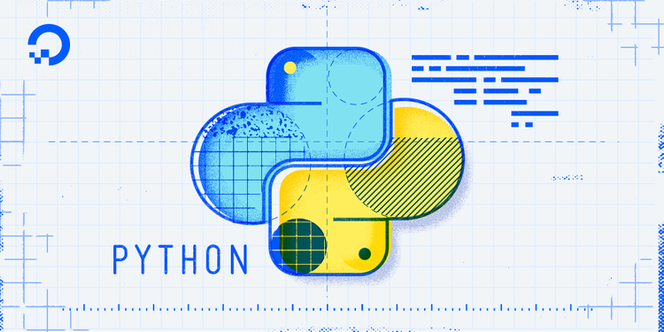
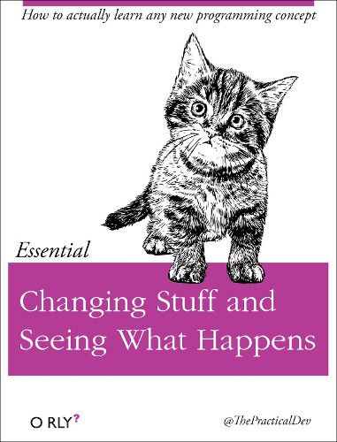
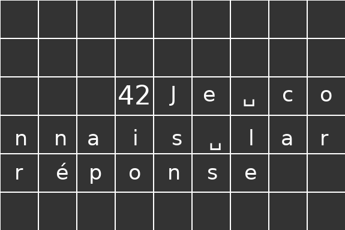
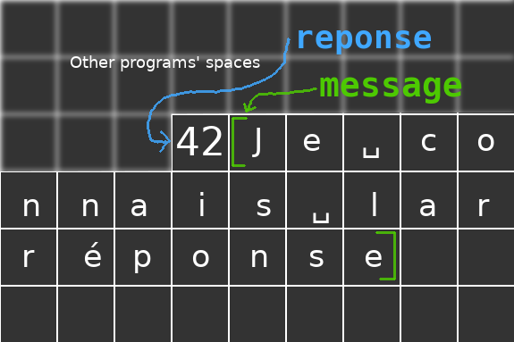
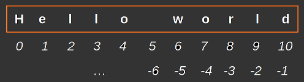
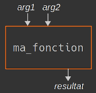
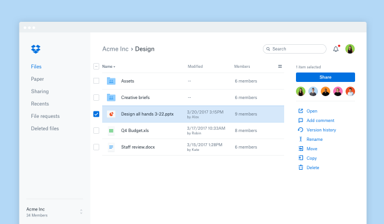
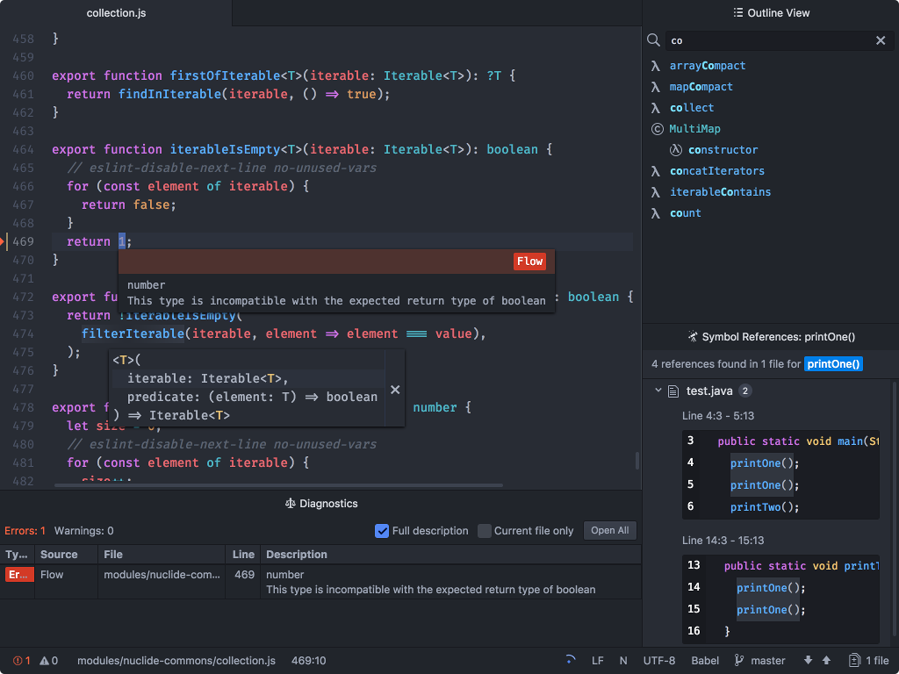
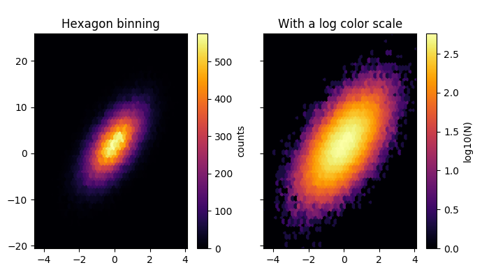
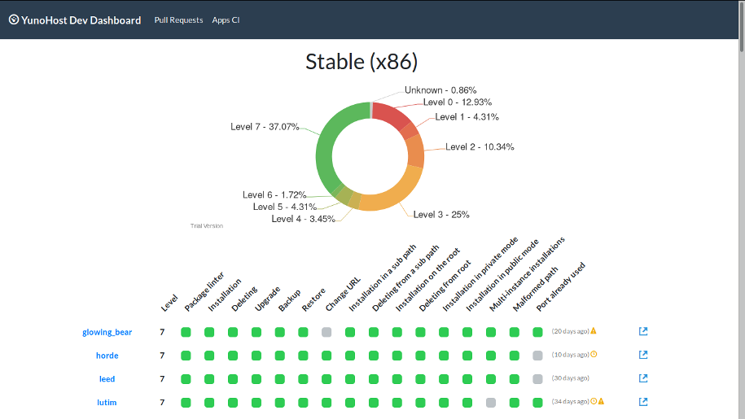

title: Introduction à Python
class: animation-fade
layout: true

<!-- This slide will serve as the base layout for all your slides -->
<!--
.bottom-bar[
  {{title}}
]
-->

---

class: impact

# {{title}}
*From padawan to jedi master in five days!*

---

class: impact

## Hello, world!

---

## À propos de moi

.col-4[
.center[

]
]

.col-8[.center[
<br>
<br>
<br>
`https://github.com/alexAubin`
<br>
<br>
`alex.aubin@mailoo.org`
<br>
<br>
<br>
<br>
]]

.col-4[.center[
Ingénieur/Physicien
</br>
</br>

]]

.col-4[.center[
Dev / hacktiviste?


]]

.col-4[.center[
Formateur


]]

---

## À propos de vous

---

# Enseigner et apprendre la programmation

#### (Mauvaises nouvelles)

- Abstrait
- Booooring exercices
- Disparité de vitesses d'apprentissage
- Rien ne remplace l'expérience..
- Eloigné du taf de "la vraie vie" :
    - Analyse, architecture, UX, debugging, refactoring, tests, VCS, ...

---

# Enseigner et apprendre la programmation

#### (Bonnes nouvelles)

- On a du temps
- Je suis payé pour répondre à vos questions \o/
- Vous montrer l'essentiel et l'utile
- Exercices ludiques ?
- Priorité aux moins rapides
- Devenir architecte du cyberespace


---

# Objectifs

Transmettre :

- Des bases solides et une vue globale
- De l'enthousiasme !
- Des bonnes pratiques ?
- Du "pragmatisme" et du fun ?

---

# Plan

### Partie 1 : Notions de "bases" (~ 2.5 jours ?)

- Variables, fonctions
- Structures de contrôle (conditions, boucles)
- Structures de données (listes, dictionnaires, ...)
- Fichiers, exceptions, librairies, ...

### Partie 2 : Notions avancées (~2.5 jours ?)

- Objets et classes en Python
- Manipulation de XML
- Debuggage avec pdb / ipdb
- Base de donnée / ORM
- Construction d'intefaces graphiques
- Parallelisation ? Plots ?
- ...

---

# Fonctionnement du cours

Alternances entre explications théoriques sur une notion donnée

et mise en application sur des exercices.

# Évaluation

- QCM et bouts de programmes à compléter
- Basé sur des cas et erreurs "courantes" vues dans les exercices

# Logistique ?

- 9h -> 12h30 ? pause vers 10h30 ?
- 13h30 -> 17h ? pause vers 15h ?

---


class: impact

# La programmation

---

class: impact

## L'ordinateur comme outil universel

---

class: impact

# « Informatique »

---

# Informatique

<br>
<br>
<br>
.center[]


---

# La programmation

## Cuisiner de l'information

* Préparer **des outils** et **des ingrédients**
* Donner **des instructions**
* ... parfois en utilisant **des "fonctions"**
    * _« monter des oeufs en neige »_
    * _« cuire à thermostat 6 pendant 20 minutes »_

---

# *Langage* de programmation

## Comme un vrai langage !

0. **Concepts** (mots, verbes, phrases ...)
1. **Grammaire et syntaxe**
2. **Vocabulaire**
3. **Organiser** sa rédaction et ses idées : **structurer** correctement son code et ses données

---

# Python

.center[]

- Versatile
- "Moyen-niveau"
- Syntaxe légère, lisible, facile à prendre en main
- Interprété, "scripting"
- Typage dynamique
- Prototypage rapide
- Grande communauté
- De plus en plus répandu

---

# Python history

.col-8[
   « ... In December 1989, I was looking for a **"hobby" programming project that would keep me occupied during the week around Christmas**. My office ... would be closed, but I had a home computer, and not much else on my hands.
   <br>
   <br>
   I decided to write an interpreter for the new scripting language I had been thinking about lately: a descendant of ABC that would appeal to Unix/C hackers.
   <br>
   <br>
   I chose Python as a working title for the project, being in a slightly irreverent mood (and a big fan of Monty Python's Flying Circus). »
.right[— Guido van Rossum]
]

.col-4[

]


---

class: impact


*Programming mindset*

---

class: impact

# Machines ain't smart.

# You are !

---

.center[]

---

.center[]

---

class: impact

## Programming *is* complicated

## <br>
## Don't be ashamed
## of not understanding right away

---

.center[]

---

# Cassez des trucs !

.center[]

---

# Explorez !

.center[]

---


# Setup

- VM Linux
- Python (3.x)

## Pour débutter

- **Thonny** : `pip3 install thonny` <small>(après avoir installé `python3-pip` et `python3-tk`)</small>

## Plus tard

- **Vim** (éditeur en console pour ninjas)
- **Atom** (IDE relativement minimaliste, épuré et extensible)
- **Pycharm** (IDE très gros qui fait même le café)
- ???

---

# 0. Hello world !

Dans Thonny :

```python
print("Hello, world!")
```

---

# Parenthèse : Python 2 vs Python 3

- Python 2 existe depuis 2000
- Python 3 existe depuis 2008
- Fin de vie de Python 2 en 2020
- ... mais encore la version par défaut dans de nombreux système ... (c.f. `python --version`)

.center[
il faut lancer `python3` explicitement ! <small>(et non `python`)</small>
]

## Différences principales

- `print "toto"` ne fonctionnera pas en Python 3 (utiliser `print("toto")`
- Nommage des paquets debian (`python-*` vs `python3-*`)
- Gestion de l'encodage
- `range`, `xrange`


---

# 0. Executer du code Python (1/2)

## Executer un script explicitement avec python

```bash
$ python3 hello.py
```

## ou implicitement (shebang)

```python
#!/usr/bin/env python3

print("Hello, world!")
```

puis on rend le fichier executable et on l'execute

```bash
$ chmod +x hello.py
$ ./hello.py
```

---

# 0. Executer du code Python (2/2)

## En interactif

```bash
$ python3
>>> print("Hello, world!")
```

### `ipython3` : alternative à la console 'classique'

```bash
$ apt install ipython3
$ ipython3
In [1]: print("Hello, world!")
```

### pour quitter : `exit`


---

class: impact

# 1. Les variables

---

# 1. Les variables

## 1.1. Exemple

```python
message = "Je connais la réponse à l'univers, la vie et le reste"
reponse = 6 * 7

print(message)
print(reponse)
```

---

# 1. Les variables

.center[]

---

# 1. Les variables

## 1.2. Principe

- Les variables sont des abstractions de la mémoire
- Un contenant pour une information : nom + contenu
- Différent du concept mathématique

.center[]

---

# 1. Les variables

## 1.2. Principe

- Les variables sont des abstractions de la mémoire
- Un contenant pour une information : nom + contenu
- Différent du concept mathématique

.center[]

---

# 1. Les variables

## 1.3. Déclaration, utilisation

- En python : déclaration implicite
- Ambiguité : en fonction du contexte, `x` désigne soit le contenant, soit le contenu...

```python
x = 42     # déclare (implicitement) une variable et assigne une valeur
x = 3.14   # ré-assigne la variable avec une autre valeur
y = x + 2  # déclare une autre variable y, à partir du contenu de x
print(y)   # affichage du contenu de y
```

## 1.4 Restriction sur le nommage

- Noms des variables : caractères alphanumérique et `_`.
- (Sans commencer par un chiffre)


---

# 1. Les variables

## 1.5. Opérations mathématiques

```python
2 + 3   # Addition
2 - 3   # Soustraction
2 * 3   # Multiplication
2 / 3   # Division
2 % 3   # Modulo
2 ** 3  # Exponentiation
```

---

# 1. Les variables

## 1.6. Types

```python
reponse = 42      # Entier / integer               / int
pi = 3.1415       # Réel                           / float
prenom = "Alex"   # Chaîne de caractère (string)   / str
oui = True        # Booléen                        / bool
```

Connaître le type d'une variable : `type(variable)`

---

# 1. Les variables

## 1.7. Conversion de type

```python
int("3")      -> 3
str(3)        -> "3"
float(3)      -> 3.0
int(3.14)     -> 3
str(3.14)     -> "3.14"
float("3.14") -> 3.14
int(True)     -> 1
int("trois")  -> Erreur
```

---

class: impact

# 2. Interactivité basique


---

# 2. Interactivité basique

En terminal, il est possible de demander une information à l'utilisateur
avec `input("message")`

```python
reponse = input("Combien font 6 fois 7 ?")
```

N.B. : ce que renvoie `input()` est une chaîne de caractère !

---

# 2. Interactivité basique

<br>
<br>
<br>
.center[Demo dans Thonny]

---

class: impact

# 3. Chaînes de caractères

---


# 3. Chaînes de caractères

.center[]

--

### Longueur

```python
m = "Hello world"
len(m)        # -> 11
```

--

### Extraction


```python
m[:5]    # -> 'Hello'
m[6:8]   # -> 'wo'
m[-3:]   # -> 'rld'
```

---

# 3. Chaînes de caractères

### Multiplication

```python
"a" * 6    # -> "aaaaaa"
```

### Concatenation

```python
"Cette phrase" + " est en deux morceaux."
"J'ai " + str(28) + " ans."
```

### Construction à partir de données, avec `format`

```python
"Je m'appelle {name} et j'ai {age} ans".format(name="Alex", age=28)
"My name is {name} and I am {age} y.o.".format(name="Alex", age=28)
```

---

# 3. Chaînes de caractères

### Substitution

```python
"Hello world".replace("Hello", "Goodbye")   # -> "Goodbye world"
```

### Chaînes sur plusieurs lignes

- `\n` est une syntaxe spéciale faisant référence au caractère "nouvelle ligne"

```python
"Hello\nworld"     # -> Hello <nouvelle ligne> world
```

### Et bien d'autres choses !

c.f. documentation, e.g `https://devdocs.io/python~3.7/library/stdtypes#str`

---

class: impact

# 4. Fonctions


---

# 4. Fonctions

## 4.1 Principe

Donner un nom à un ensemble d'instructions (modularité, sémantique)

.col-6[
```python
def ma_fonction(arg1, arg2):
    instruction1
    instruction2
    ...
    return resultat
```
]

.col-6[
.center[
    
]
]

On peut ensuite utiliser la fonction et récupérer le resultat :

```python
mon_resultat = ma_fonction("pikachu", "bulbizarre")
autre_resultat = ma_fonction("salameche", "roucoups")
```

---

# 4. Fonctions

.col-6[
```python
def ma_fonction(arg1, arg2):
    instruction1
    instruction2
    ...
    return resultat
```
]

.col-6[
.center[
    
]
]

## 4.2 Elements de syntaxe

- `def`, `:`
- indentation !!
- Des arguments
- `return`


---

# 4. Fonctions

## 4.3 Exemple

```python
def distance(dx, dy):
    dx_carre = dx ** 2
    dy_carre = dy ** 2
    return racine_carree(dx_carre + dy_carre)
```

Utilisation :

```python
D = distance(3, 5)       # -> D vaut 5.830951894845301
```

---

# 4. Fonctions

## 4.3 Exemple

```python
def distance(dx, dy):
    dx_carre = dx ** 2
    dy_carre = dy ** 2
    print(racine_carree(dx_carre + dy_carre))
```

Utilisation :

```python
D = distance(3, 5)       # -> D vaut None !
```


---

# 4. Fonctions

## 4.4 Variables locales

```python
def distance(dx, dy):
    dx_carre = dx ** 2
    dy_carre = dy ** 2
    return racine_carree(dx_carre + dy_carre)
```

- Les variables créées dans la fonction sont **locales**
- Les noms dx, dy sont égalements "locaux" : ils font reference aux arguments de cette fonction, meme si d'autres variables nommées dx ou dy existent ailleurs dans le code !

---

# 4. Fonctions

## 4.5 `return`

- `return` **quitte immédiatement la fonction !**
- Il peut néanmoins y avoir plusieurs `return` dans une fonction (mais seul un sera executé)
- Une fonction sans `return` renvoie implicitement `None`.

---

# 4. Fonctions

## 4.6 Arguments optionnels

Les arguments peuvent être rendu optionnels si ils ont une valeur par défaut :

```python
def distance(dx, dy=0, dz=0):
    [...]
```

Dans ce cas, tous ces appels sont valides :

```python
distance(1)
distance(1, 2)
distance(1, 2, 3)
distance(1, dy=2)
distance(1, dz=3)
distance(1, dy=2, dz=3)
distance(1, dz=3, dy=2)
```

---

# 4. Fonctions

## 4.6 Arg. optionnels : exemple de la vraie vie

```python
subprocess.Popen(args,
                 bufsize=0,
                 executable=None,
                 stdin=None,
                 stdout=None,
                 stderr=None,
                 preexec_fn=None,
                 close_fds=False,
                 shell=False,
                 cwd=None,
                 env=None,
                 universal_newlines=False,
                 startupinfo=None,
                 creationflags=0)
```

c.f. `https://docs.python.org/2/library/subprocess.html#subprocess.Popen`

---

# 4. Fonctions

## 4.7 Différence avec le concept mathématique

- Domaine généralement mal défini (e.g. type d'entrée et de sortie)
- Effets de bords (e.g. `print()`)

---

class: impact

# 5. Conditions

---

# 5. Conditions

Gérer des cas pour adapter le fonctionnement du programme

## 5.1 Syntaxe générale

```python
if condition:
    instruction1
    instruction2
elif (autre condition):
    instruction3
elif (encore autre condition):
    instruction4
else:
    instruction5
    instruction6
```

Attention à l'indentation !

---

# 5. Conditions

Tout n'est pas nécessaire, par exemple on peut simplement mettre un `if` :

```python
if condition:
    instruction1
    instruction2
```

---

# 5. Conditions

## 5.2 Exemple

```python
def dire_bonjour(nom):
    if nom == "Jack Sparrow":
        return "Bonjour, *Capitaine* " + nom
    else:
        return "Bonjour, " + nom
```

.center[]

---

# 5. Conditions

## 5.3 Lien avec les booléens

Les conditions comme `nom == "Jack Sparrow"` sont en fait transformées en booléen lorsque la ligne est interprétée.

On aurait pu écrire :

```python
is_jack_sparrow = (nom == "Jack Sparrow")

if is_jack_sparrow:
    [...]
else:
    [...]
```

---

# 5. Conditions

## 5.4 Écrire des conditions

```python
angle == pi      # Égalité
angle != pi      # Différence
angle > pi       # Supérieur
angle >= pi      # Supérieur ou égal
angle < pi       # Inférieur
angle <= pi      # Inférieur ou égal
```

### Combiner des conditions

```python
not (nom == "Jack Sparrow")                # Négation
(nom == "Sparrow") and (prenom == "Jack")  # ET
(nom == "Sparrow") or (prenom == "Jack")   # OU inclusif
```

---

# 5. Conditions

## 5.5 Conditions "avancées"

### Chercher des choses dans des chaînes de caractères

```python
"Jack" in nom           # 'nom' contient 'Jack' ?
nom.startswith("Jack")  # 'nom' commence par 'Jack' ?
nom.endswith("row")     # 'nom' fini par 'row' ?
```

### 'Inline' `if`s

```python
parite = "pair" if n % 2 == 0 else "impair"
```


---

# Python dans la vraie vie

.center[Dropbox]

.center[]

---

# Python dans la vraie vie

.center[Atom]

.center[]

---

# Python dans la vraie vie

.center[Eve online]

.center[]

---

# Python dans la vraie vie

.center[Matplotlib]

.center[]

---

# Python dans la vraie vie

.center[Blender]

.center[]

---

# Python dans la vraie vie

.center[OpenERP / Odoo]

.center[]

---

# Python dans la vraie vie

.center[Tartiflette]

.center[]


---

class: impact

# 6. Exceptions, assertions


---

# 6. Exceptions, assertions

Les exceptions correspondent à des erreurs ou des cas particuliers qui empêchent
(a priori) la suite du déroulement du programme ou d'une fonction.

### Exemple

```python
>>> int("test")
[...]
ValueError: invalid literal for int() with base 10: 'test'
```

---

# 6. Exceptions, assertions

## 6.1 `try`/`except`

En Python, il est courant d'« essayer » des opérations puis de gérer les
exceptions.

On utilise pour cela des `try: ... except: ...`. On peut déclencher nos propres
exceptions avec `raise Exception("message")`

### Exemple

```python
try:
    str = input("Entrez un entier svp !")
    n = int(str)
except:
    raise Exception("Ce n'est pas un entier !")
```

---

# 6. Exceptions, assertions

### Utilisation différente

```python
try:
    str = input("Entrez un entier svp !")
    n = int(str)
except:
    n = -1
```

---

# 6. Exceptions, assertions

<br>
<br>
<br>
<br>

.center[
## The "python way"
### « Better to ask forgiveness than permissions »


<br>
(ça se discute)
]

---


# 6. Exceptions, assertions

## 6.2 Assertions

Il est possible d'utiliser des `assert`ions pour **expliciter certaines hypothèses**
faites pendant l'écriture du code. Si elles ne sont pas remplies, une exception est déclenchée.

```python
def dire_bonjour(nom):
    assert isinstance(nom, str), "'nom' devrait être une chaine !"
    print("Bonjour {nom} !".format(nom=nom))
```

---

# 6. Exceptions, assertions

## 6.2 Assertions (autre exemple)

```python
def distance(x=0, y=0):
    assert isinstance(x, (int, float)), "Cette fonction ne prends que des int ou float en argument !"
    assert isinstance(y, (int, float)), "Cette fonction ne prends que des int ou float en argument !"

    return racine_carree(x*x + y*y)
```

---

# 6. Exceptions, assertions

## 6.2 Assertions (encore un autre exemple)

```python
def some_function(n):
    assert isinstance(n, int), "Cette fonction ne prends que des int en argument !"
    assert n % 2 == 0, "Cette fonction ne prends que des entiers pairs en argument !"

    [...]
```


---

# 6. Exceptions, assertions

## Plusieurs approches (1/3)

Calcul de la racine carrée d'un nombre.

> Je soupçonne fortemment que `x` puisse être négative

```python
if x < 0:
    print("Erreur : x est negatif !")
else:
    resultat = racine_carree(x)
```

Attention : `resultat` n'existera pas si x est negatif
... que fait la suite du programme ?

---

# 6. Exceptions, assertions

## Plusieurs approches (2/3)

Calcul de la racine carrée d'un nombre

> Ça devrait marcher, mais j'ai un doute ...

```python
try:
    resultat = racine_carree(x)
except ValueError as e:
    print("Erreur : peut-etre que x est negatif ?")
```

Attention : `resultat` n'existera pas si x est negatif
... que fait la suite du programme ?

---

# 6. Exceptions, assertions

## Plusieurs approches (3/3)

Calcul de la racine carrée d'un nombre

> Je soupçonne fortement que le nombre soit positif

```python
assert x > 0, "Tiens, x est negatif ?"

resultat = racine_carree(x)
```

---


# 6. Exceptions, assertions

## 6.3 Pour aller plus loin : type hints ! (Python >= 3.6)

```python
from typing import Union
float_or_int = Union[float, int]

def distance(x: float_or_int, y: float_or_int) -> float:
    return racine_carree(x*x + y*y)
```

---

class: impact

# 7. Les boucles


---

# 7. Boucles

Répéter plusieurs fois un même ensemble d'instruction

- pour plusieurs valeurs (`for`)
- tant qu'une condition est remplie (`while`)

---

# 7. Boucles

## 7.1 Les boucles `for`

```python
for i in range(0,10):
    print("En ce moment, i vaut " + str(i))
```

affiche :
```python
En ce moment, i vaut 0
En ce moment, i vaut 1
En ce moment, i vaut 2
...
En ce moment, i vaut 9
```

---

# 7. Boucles

## 7.2 `continue` et `break`

`continue` permet de passer immédiatement à l'itération suivante

`break` permet de sortir immédiatement de la boucle

---

# 7. Boucles

## 7.2 `continue` et `break`

```python
for i in range(0,10):
    if i % 2 == 0:
        continue

    print("En ce moment, i vaut " + str(i))
```

-> Affiche le message seulement pour les nombres impairs

---

# 7. Boucles

## 7.2 `continue` et `break`

```python
for i in range(0,10):
    if i == 7:
        break

    print("En ce moment, i vaut " + str(i))
```

-> Affiche le message pour 0 à 6

---

# 7. Boucles

## 7.3 Boucle `while`

(un peu moins utilisé que `for`)

```python
x = 40
while x % 2 == 0:
    print(str(x) + " est pair !")
    x = x/2

print(str(x) + " est impair !")
```

---

class: impact

# 8. Structures de données

---

# 8. Structures de données

Les listes et dictionnaires permettent de stocker des séries
d'information...

## 8.1 Les listes

```python
favourite_pokemons = [ "Bulbizarre", "Roucoups", "Insecateur" ]
fibonnaci = [ 1, 1, 2, 3, 5, 8 ]
stuff = [ 3.14, 42, "bidule", ["a", "b", "c"] ]
```

### Accès à un élément particulier

```python
favourite_pokemons[1]    ->  "Roucoups"
```

### Longueur

```python
len(favourite_pokemons)    -> 3
```

---

# 8. Structures de données

```python
favourite_pokemons = [ "Bulbizarre", "Roucoups", "Insecateur" ]
```

### Iteration

```python
for pokemon in favourite_pokemons:
    print(pokemon + " est un de mes pokemons préférés !")
```

### Iteration avec index

```python
for i, pokemon in enumerate(favourite_pokemons):
    print(pokemon + " est mon "+ str(i) +"ème pokemon préféré !")
```

---

# 8. Structures de données

```python
favourite_pokemons = [ "Bulbizarre", "Roucoups", "Insecateur" ]
```

### Modification d'un élément

```python
favourite_pokemons[1] = "Roucarnage"
```

### Ajout à la suite

```python
favourite_pokemons.append("Mewtwo")
```

### Insertion

```python
favourite_pokemons.insert(1, "Papillusion")
```

---

# 8. Structures de données

### Transformation de string en liste

```python
"Hello World".split()    -> ["Hello", "World"]
```

### Transformation de liste en string

```python
' | '.join(["a", "b", "c"])      -> "a | b | c"
```

---

# 8. Structures de données

## 8.2 Les dictionnaires

```python
ages = { "Alice": 20, "Bob": 24, "Charlie": 19 }
```

N.B. : dans les dictionnaires, l'ordre des éléments est sans importance !

### Accès à une valeur

```python
ages["Charlie"]      -> 19
ages["Elie"]         -> KeyError !
ages.get("Elie", -1) -> -1
```

### Modification d'une entrée, ajout d'une nouvelle entrée

```python
ages["Charlie"] += 1
ages["Deborah"] = 21
```

---

```python
ages = { "Alice": 20, "Bob": 24, "Charlie": 19 }
```

### Iteration sur les clefs

```python
for prenom in ages:
    print("Je connais l'age de "+prenom)
```

### Iteration sur les valeurs

```python
for age in ages.values():
    print("Quelqu'un a "+str(age)+" ans")
```

### Iterations sur les clefs et valeurs

```python
for prenom, age in ages.items():
    print(prenom + " a " + str(age) + " ans !")
```

---

# 8. Structures de données

## 8.3 Les sets

Les `set`s stockent des éléments de manière unique et désordonnée.

```python
chat = set("chat")     # -> {'h', 'c', 'a', 't'}
chien = set("chien")   # -> {'c', 'e', 'i', 'n', 'h'}
chat - chien           # -> {'a', 't'}
chien - chat           # -> {'i', 'n', 'e'}
chat & chien           # -> {'h', 'c'}
chat | chien           # -> {'c', 't', 'e', 'a', 'i', 'n', 'h'}
chat.add("z")          # ajoute `z` à `chat`
```

---

# 8. Structures de données

## 8.4 Les tuples

Les tuples permettent de stocker des données de manière similaire à une liste, mais de manière non-mutable. Typiquement : des coordonnées de point.

```python
P = (2,3)
P[0]        # -> 2
P[1]        # -> 3
P[0] = 5    # -> Erreur!
```

---

# 8. Structures de données

## 8.5 List/dict comprehensions

Les "list/dict comprehensions" sont des syntaxes particulière permettant de rapidement construire des listes (ou dictionnaires) à partir d'autres structures.

### Syntaxe (list comprehension)

```python
[ new_e for e in liste if condition(e) ]
```

### Exemple (list comprehension)

Carré des entiers impairs d'une liste

```python
[ e**2 for e in liste if e % 2 == 1 ]
```

---

# 8. Structures de données

## 8.5 List/dict comprehensions

Les "list/dict comprehensions" sont des syntaxes particulière permettant de rapidement construire des listes (ou dictionnaires) à partir d'autres structures.

### Syntaxe (dict comprehension)

```python
{ new_k:new_v for k, v in d.items() if condition(k, v) }
```

### Exemple (dict comprehension)

Carré des entiers impairs d'une liste

```python
{ nom: age-20 for nom, age in ages.items() if age >= 20 }
```

---

# 8. Structures de données

## 8.6 Générateurs

(Pas vraiment une structure de données, mais c'est lié aux boucles ...)

- Une fonction qui renvoie **des** résultats "au fur et à mesure" qu'ils sont demandés ...
- Se comporte comme un itérateur
- Peut ne jamais s'arrêter ...!
- Typiquement, évite de créer des listes intermédiaires 

---

# 8. Structures de données

## 8.6 Générateurs : exemple SANS generateur

```python
mes_pokemons = { "Bulbizarre": 12,    "Pikachu": 25, 
                 "Rattata": 15,       "Rondoudou": 23
                 # [...]
               }

def au_moins_niveau_20(pokemons):

    output = []
    for pokemon, niveau in pokemons.items():
        if niveau >= 20:
            output.append(pokemon)

    return output

###

for pokemon in au_moins_niveau_20(mes_pokemons):
   ...
```

---

# 8. Structures de données

## 8.6 Générateurs : exemple AVEC generateur

```python
mes_pokemons = { "Bulbizarre": 12,    "Pikachu": 25, 
                 "Rattata": 15,       "Rondoudou": 23
                 # [...]
               }

def au_moins_niveau_20(pokemons):

    for pokemon, niveau in pokemons.items():
        if niveau >= 20:
            yield pokemon

####

for pokemon in au_moins_niveau_20(mes_pokemons):
   ...
```

Il n'est pas nécessaire de créer la liste intermédiaire `output`

---

# 8. Structures de données

## 8.6 Générateurs : autre exemple

```python
def factoriel():
   
   n = 1
   acc = 1
   
   while True:
       acc *= n
       n += 1

       yield acc
```

---

class: impact

# 9. Fichiers

---

# 9. Fichiers

## 9.1 Lire

```python
with open("/etc/passwd", "r") as f:
    toutes_les_lignes = f.readlines()

for ligne in toutes_les_lignes:
    print(ligne)
```

### Explications

- `open("fichier", "r")` ouvre un fichier en lecture
- `with ... as ...` ouvre un contexte, à la fin duquel le fichier sera fermé
- `f.readlines()` permet d'obtenir une liste de toutes les lignes du fichier

---

# 9. Fichiers

## 9.1 Lire

- `f.readlines()` renvoie une **liste** contenant les lignes une par une
- `f.read()` renvoie une (grande) **chaĩne** contenant toutes les lignes concaténées

---

# 9. Fichiers

## 9.2 Ecrire

### En remplacant tout !

```python
with open("/home/alex/test", "w") as f:
    f.write("Plop")
```

### À la suite (« append »)

```python
with open("/home/alex/test", "a") as f:
    f.write("Plop")
```

---

# 9. Fichiers

## 9.3 Fichiers et exceptions

```python
try:
    with open("/some/file", "r") as f:
        lines = f.readlines()
except:
    raise Exception("Impossible d'ouvrir le fichier en lecture !")
```

---

# 9. Fichiers

## 9.3 Fichiers et exceptions (autre exemple)

```python
try:
    with open("/etc/shadow", "r") as f:
        lines = f.readlines()
except PermissionError:
    raise Exception("Pas le droit d'ouvrir le fichier !")
except FileNotFoundError:
    raise Exception("Ce fichier n'existe pas !")
```

---

# 9. Fichiers

## 9.4 Note "technique" sur la lecture des fichiers

- Il y a un "curseur de lecture". On peut lire petit morceaux par petit morceaux ... une fois arrivé au bout, il n'y a plus rien à lire, il faut replacer le curseur si on veut de nouveau lire.

```python
f = open("/etc/passwd")
print(f.read())  # ---> Tout plein de choses
print(f.read())  # ---> Rien !
f.seek(0)        # On remet le curseur au début
print(f.read())  # ---> Tout plein de choses !
```

---

class: impact

# 10. Librairies

---

# 10. Librairies

L'une des puissances de python vient de l'écosystème de librairie disponibles.

Librairie / bibliothèque / module : un ensemble de fonctionnalité déjà pensés et
éprouvées, prêtes à l'emploi.

### Syntaxes d'import

```python
import un_module          # -> Importer tout un module
un_module.une_fonction()  # -> Appeler la fonction une_function()
                          #    du module
```

### Exemple

```python
import math

math.sqrt(2)   # -> 1.4142135623730951
```


---

# 10. Librairies

### Importer juste des choses précises

```python
from un_module import une_fonction, une_autre

une_fonction(...)
```

### Exemple

```python
from math import sqrt, sin, cos

sqrt(2)   # -> 1.4142135623730951
```


---

# 10. Librairies

## 10.1 Exemple : `json`

```python
{
    "mailman": {
        "branch": "master",
        "level": 2,
        "state": "working",
        "url": "https://github.com/yunohost-apps/mailman_ynh",
        "flags": [ "mailing-list", "lightweight" ]
    },
    "mastodon": {
        "branch": "master",
        "level": 3,
        "state": "inprogress",
        "url": "https://github.com/YunoHost-Apps/mastodon_ynh",
        "flags": [ "social network", "good-UX" ]
    }
}
```
---

# 10. Librairies

## 10.1 Exemple : `json`

```python
import json

# Ouvrir, lire et interpreter un fichier json
with open("applications.json") as f:
    j = json.loads(f.read())


# Trouver l'état de l'application mailman
j["mailman"]["state"]     # -> "working"
```

---

# 10. Librairies

## 10.2 Exemple : `csv`

```python
import csv

# Ouvrir et lire les lignes d'un fichier csv
with open("table.csv") as f:
    table = csv.reader(f, delimiter='|')
    for row in table:
        print(row[1]) # Afficher le 2eme champ
        print(row[3]) # Afficher le 4eme champ

with open("newtable.csv", "w") as f:
    newtable = csv.write(f, delimiter=",")
    newtable.writerow(["Alice", 32, "Lyon"])
    newtable.writerow(["Bob", 29, "Bordeaux"])
```

---

# 10. Librairies

## 10.2 Exemple : `requests`

Envoyer une requête HTTP et récuperer la réponse (et potentiellement le
contenu d'une page)

```python
import requests

r = requests.get("https://en.wikipedia.org/wiki/Python", timeout=30)

print(r.status_code)    # -> 200 si ça a marché
print(r.text)           # -> Le contenu de la page
```

---

# 10. Librairies

## 10.3 Exemple : `os`

`os` permet d'interagir avec le système d'exploitation pour réaliser différent
type d'action... Certaines étant spécifiques à l'OS en question (Linux, Windows,
...)

Quelques exemples :

```python
import os
os.listdir("/etc/")  # Liste les fichiers dans /etc/
os.path.join("/etc", "passwd") # Génère un chemin à partir de plusieurs parties
os.system("ls /etc/") # (à éviter) Execute une commande "brute"
```

Voir aussi : copie ou suppression de fichiers, modification des permissions, ...

---

# 10. Librairies

## 10.4 Exemple : `subprocess`

`subprocess` peut typiquement être utiliser pour lancer des commandes et
récupérer leur résultat

```python
out = subprocess.check_output(["echo", "Hello World!"])
print(out)    # -> Affiche 'Hello World'
```

- `check_output` : recupère la sortie d'une commande
- `check_call` : verifie que la commande a bien marché (code de retour '0') ou declenche une exception
- `Popen` : méthode plus bas niveau

---

# 10. Librairies

## 10.4 Exemple : `io`

Par exemple, pour créer des objets "file-like". Par exemple : 

```python
import io

f = io.StringIO("some initial text data")
print(f.read())    # -> 'some initial text data'
f.seek(0)
f.write("i am writing")
print(f.read())    # -> 'i am writing text data'
```

---

# 10. Librairies

## 10.6 Ecrire ses propres modules

Considérant les fichiers suivants :

```bash
├── main.py
└── mylib/
    ├── __init__.py
    └── bonjour.py      # <-- Contient "def dire_bonjour..."
```

Depuis `main.py`, je peux faire

```python
from mylib.bonjour import dire_bonjour

dire_bonjour("Alex") # -> "Bonjour Alex !"

print(dire_bonjour)
# -> <function dire_bonjour at 0x7fb964fab668>
```

---

# 10. Librairies

## Ecrire ses propres modules

Considérant les fichiers suivants :

```bash
├── main.py
└── mylib/
    ├── __init__.py
    └── bonjour.py      # <-- Contient "def dire_bonjour..."
```

Depuis `main.py`, je peux *aussi* faire

```python
from mylib import bonjour

bonjour.dire_bonjour("Alex") # -> "Bonjour Alex !"

print(bonjour)
# -> <module 'mylib.bonjour' from 'mylib/bonjour.pyc'>
```


---

# 10. Librairies

.center[]

---

# 10. Librairies

## Moar ?

- Debian packages : `python-*`
- Python package manager : `pip`

## Exemples

- JSON, XML, HTML, YAML, ...
- Regular expressions
- Logging, Parsing d'options, ...
- Internationalisation
- Templating
- Plots, LDAP, ...

---

class: impact

# 11. Outils et bonnes pratiques

---

# Documentation

Pour les librairies :
- `docs.python.org`
- `devdocs.io`
- stack overflow ...
- doc strings

Pour votre code :
- nom de variables, fonctions, argument !!!
- commentaires, doc strings
- generation de doc automatique ?

---

# `pip`

- Gestionnaire de paquet / modules Python
- PIP : "Pip Install Packages"
- PyPI : Python Package Index
- Installer un paquet :
    - `pip3 install <paquet>` 
- Rechercher un paquet :
    - `pip3 search <motclef>`
- Installer une liste de dépendances :
    - `pip3 install -r requirements.txt`
- Lister les paquets installés
    - `pip3 list`, `pip3 freeze`
- Les paquets installés sont dans `/usr/lib/python*/dist-packages/`

---

# Syntaxe, PEP8, linters

- Le style d'écriture de python est standardisé via la norme PEP8
- Il existe des "linter" pour détecter le non-respect des conventions (et également des erreurs logiques)
    - Par exemple `flake8`, `pylint`
- Intégration possible dans `vim` et autres IDE...
- `autopep8` permet de corriger un bon nombre de problème automatiquement

---

# Debugging interactif : `pdb`, `ipdb`

- Python DeBugger
- Permet (entre autre) de définir des "break point" pour rentrer en interactif
   - `import ipdb; ipdb.set_trace()`
   - en 3.7 : `breakpoint()` <small>Mais fait appel à `pdb` et non `ipdb` ?</small>
- Une fois en interactif, on peut inspecter les variables, tester des choses, ...
- On dispose aussi de commandes spéciales pour executer le code pas-à-pas
- Significativement plus efficace que de rajouter des `print()` un peu partout !

---

# Debugging interactif : `pdb`, `ipdb`

### Commandes spéciales

- `l(ist)` : affiche les lignes de code autour de code (ou continue le listing precedent)
- `c(ontinue)` : continuer l'execution normalement (jusqu'au prochain breakpoint)
- `s(tep into)` : investiguer plus en détail la ligne en cours, possiblement en descendant dans les appels de fonction
- `n(ext)` : passer directement à la ligne suivante
- `w(here)` : print the stack trace, c.a.d. les différents sous-appels de fonction dans lesquels on se trouve
- `u(p)` : remonte d'un cran dans les appels de la stacktrace
- `d(own)` : redescend d'un cran dans les appels de la stacktrace

- `pp <variable>` : pretty-print d'une variable (par ex. une liste, un dict, ..)

