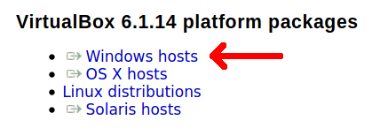
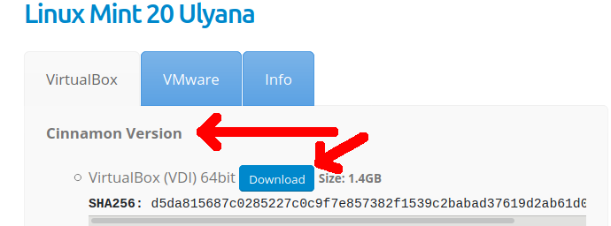

title: Introduction à Python
class: animation-fade
layout: true

<!-- This slide will serve as the base layout for all your slides -->
<!--
.bottom-bar[
  {{title}}
]
-->

---

<br/>

.center[


# {{title}}

*Devenez un jedi de la programmation en cinq jours!*
]

---

class: impact

## Hello, world!


<!-- 

## En attendant : 

- Aller sur virtualbox.org > Downloads > "Windows hosts"
- ... puis installer Virtualbox

.center[

]

- Aller sur osboxes.org/linux-mint

.center[

]

## En attendant : 

- Puis dans Virtualbox : créer une nouvelle VM
- Version de l'OS : Ubuntu ou "Other Linux" 64bit
- Mettre 2~4 Go de RAM
- **Utiliser un fichier de disque dur virtuel existant** : utiliser le VDI
  téléchargé

Puis se logger avec : 
- login: osboxes.org
- password: osboxes.org 
      - (attention de base clavier en querty.. ça donne: osboxes:org)

-->


---

## À propos de moi

.col-12[
.col-4[
.center[

]
]

.col-8[.center[
<br>
<br>
`https://github.com/alexAubin`
<br>
<br>
`alex.aubin@mailoo.org`
<br>
<br>
]]
]

.col-4[.center[
Ingénieur/Physicien


</br>

]]

.col-4[.center[
Dev / adminsys / ...


]]

.col-4[.center[
Formateur


]]

---

## À propos de vous

---

# Horaires ?

- 9h -> 12h30 ? pause vers 10h30 ?
- 14h -> 17h30 ? pause vers 15h30 ?

# Évaluation

- .. de la formation par les stagiaires ;)
- le dernier jour de formation

---

# Plan

#### Partie 1 : Notions de "bases" (2 ~ 3 jours)

- Variables, fonctions
- Structures de contrôle (conditions, boucles)
- Structures de données (listes, dictionnaires, ...)
- Fichiers, exceptions, librairies, ...

---

# Plan


#### Partie 2 : Orienté objet (1 jour)

- Orienté objet
   - principe
   - classes, attributs, méthodes
   - héritage
- Design patterns (patrons de conception)
- Base de données / ORM ?

---

# Plan


#### Partie 3 : Python 'avancé' (1 ~ 2 jours)

- Modules pythons : création, publication
- Bonnes pratiques : conventions, PEP8, Black, MyPy
- Debugging avec pdb / ipdb
- Multiprocess, multithreading
- Création d'interface
- Inteface Python/C


---

# Méthode de travail

Alterner entre théorie et pratique
- explications théoriques sur une notion donnée
- partage du support sur [https://aleks.internetlib.re/docs/formationPython](https://aleks.internetlib.re/docs/formationPython)
- mise en application sur des exercices.

N'hésitez pas à poser vos questions : **je suis payé pour ça !**

# Travail en distanciel

- VM Linux dans Guacamole sur [https://formationpython.internetlib.re/](https://formationpython.internetlib.re)
- Thonny

---


class: impact

# La programmation

---

class: impact

## L'ordinateur comme outil universel

---

class: impact

# « Informatique »

---

# Informatique

<br>
<br>
<br>
.center[]


---

# La programmation

## Cuisiner de l'information

* Préparer **des outils** et **des ingrédients**
* Donner **des instructions**
* ... parfois en utilisant **des "fonctions"**
    * _« monter des oeufs en neige »_
    * _« cuire à thermostat 6 pendant 20 minutes »_

---

# *Langage* de programmation

## Comme un vrai langage !

0. **Concepts** (mots, verbes, phrases ...)
1. **Grammaire et syntaxe**
2. **Vocabulaire**
3. **Organiser** sa rédaction et ses idées : **structurer** correctement son code et ses données

---

.center[]

- "Moyen-niveau" : équilibre entre performance, flexibilité et simplicité d'écriture
- Syntaxe légère, lisible, facile à prendre en main
- Interprété, "scripting", prototypage rapide
- Flexible (typage dynamique, ...)
- Grande communauté, de plus en plus répandu...

---

# Python history

.col-8[
   « ... In December 1989, I was looking for a **"hobby" programming project that would keep me occupied during the week around Christmas**. My office ... would be closed, but I had a home computer, and not much else on my hands.
   <br>
   <br>
   I decided to write an interpreter for the new scripting language I had been thinking about lately: a descendant of ABC that would appeal to Unix/C hackers.
   <br>
   <br>
   I chose Python as a working title for the project, being in a slightly irreverent mood (and a big fan of Monty Python's Flying Circus). »
.right[— Guido van Rossum]
]

.col-4[

]

---

# Environnement de travail

- VM Linux dans Guacamole
- Python (3.x)

## Pour débutter

- **Thonny** : `apt install thonny` 

## Plus tard

- **Vim** (éditeur en console pour ninjas)
- **Pycharm** (IDE très gros qui fait même le café)
- **VS Code?**
- ???

---

# 0. Hello world !

Dans Thonny :

```python
print("Hello, world!")
```

---

# 0. Hello world !

En Python, les lignes commençant par `#` sont des commentaires:

```python
# C'est mon premier programme en Python, c'est supayre!
print("Hello, world!")
```

---

# Parenthèse : Python 2 vs Python 3

- Python 2 existe depuis 2000
- Python 3 existe depuis 2008
- Fin de vie de Python 2 en 2020
- ... mais encore la version par défaut dans de nombreux système ... (c.f. `python --version`)

.center[
il faut lancer `python3` explicitement ! <small>(et non `python`)</small>
]

## Différences principales

- `print "toto"` ne fonctionnera pas en Python 3 (utiliser `print("toto")`
- Nommage des paquets debian (`python-*` vs `python3-*`)
- Gestion de l'encodage
- `range`, `xrange`
- Disponibilité des librairies ?

.center[
Il existe des outils comme 2to3 pour ~automatiser la transition
]

---

# 0. Executer du code Python (1/2)

## Executer un script explicitement avec python

```bash
$ python3 hello.py
```

## ou implicitement (shebang)

```python
#!/usr/bin/env python3

print("Hello, world!")
```

puis on rend le fichier executable et on l'execute

```bash
$ chmod +x hello.py
$ ./hello.py
```

---

# 0. Executer du code Python (2/2)

## En interactif

```bash
$ python3
>>> print("Hello, world!")
```

### `ipython3` : alternative à la console 'classique'

```bash
$ apt install ipython3
$ ipython3
In [1]: print("Hello, world!")
```

### pour quitter : `exit`


---

class: impact

# 1. Les variables

---

# 1. Les variables

## 1.1. Exemple

```python
message = "Je connais la réponse à l'univers, la vie et le reste"
reponse = 6 * 7

print(message)
print(reponse)
```

---

# 1. Les variables

.center[]

---

# 1. Les variables

## 1.2. Principe

- Les variables sont des abstractions de la mémoire
- Un contenant pour une information : nom + contenu
- Différent du concept mathématique

.center[]

---

# 1. Les variables

## 1.2. Principe

- Les variables sont des abstractions de la mémoire
- Un contenant pour une information : nom + contenu
- Différent du concept mathématique

.center[]

---

# 1. Les variables

## (parenthèse technique)

En Python, contrairement à d'autres langages, il faut voir les variables moins comme les contenants en eux-même que comme des références (ou bien (analogie) des étiquettes/post-it)
- pas très importants pour les types "simples" tels que entiers ou chaine de caractères
- important lorsqu'on parlera des listes : plusieurs variables peuvent correspondre à la même liste

---

# 1. Les variables

## 1.3. Déclaration, utilisation

- En python : déclaration implicite
- Ambiguité : en fonction du contexte, `x` désigne soit le contenant, soit le contenu...
- En python : les variables sont plutôt à voir comme des étiquettes (ou comme des références en C)

```python
x = 42     # déclare (implicitement) une variable et assigne une valeur
x = 3.14   # ré-assigne la variable avec une autre valeur
y = x + 2  # déclare une autre variable y, à partir du contenu de x
print(y)   # affichage du contenu de y
```

## 1.4 Nommage

- Caractères autorisés : caractères alphanumériques (`a-zA-Z0-9`) et `_`.
- **Les noms sont sensibles à la casse** : `toto` n'est pas la même chose que `Toto`!
- (Sans commencer par un chiffre)

---

# 1. Les variables

## 1.5 Comparaison de différentes instructions

Faire un calcul **sans l'afficher ni le stocker nul part**:
```python
6*7
```

Faire un calcul et **l'afficher dans la console**:
```python
print(6*7)
```

Faire un calcul et **stocker le résultat dans une variable `r`** pour le réutiliser plus tard
```python
r = 6*7
```

---

# 1. Les variables

## 1.6 Opérations mathématiques

```python
2 + 3   # Addition
2 - 3   # Soustraction
2 * 3   # Multiplication
2 / 3   # Division
2 % 3   # Modulo
2 ** 3  # Exponentiation
```

---

# 1. Les variables

## 1.6 Calcul avec réassignation

```python
x += 3   # Équivalent à x = x + 3
x -= 3   # Équivalent à x = x - 3
x *= 3   # Équivalent à x = x * 3
x /= 3   # Équivalent à x = x / 3
x %= 3   # Équivalent à x = x % 3
x **= 3  # Équivalent à x = x ** 3
```

---

# 1. Les variables

## 1.7 Types

```python
42            # Entier / integer               / int
3.1415        # Réel                           / float
"Alex"        # Chaîne de caractère (string)   / str
True / False  # Booléen                        / bool
None          # ... "rien" / aucun (similar à `null` dans d'autres langages)
```

Connaître le type d'une variable : `type(variable)`

On verra aussi plus tard:

```python
[1, 2, 3, "Soleil"]       # Liste
(1, 2, 3, "Soleil")       # Tuple (liste immuable)
{1, 2, 3, "Soleil"}       # Ensemble (set)
{"Alice": 43, "Bob": 24}  # Dictionnaire
```

---

# 1. Les variables

## 1.8 Conversion de type

```python
int("3")      -> 3
str(3)        -> "3"
float(3)      -> 3.0
int(3.14)     -> 3
str(3.14)     -> "3.14"
float("3.14") -> 3.14
int(True)     -> 1
int("trois")  -> Erreur / Exception
```

---


# 1. Les variables

## 1.9 Affectations multiples

```python
x, y = (3.14, "Toto")
print(x)   # -> 3.14
print(y)   # -> Toto

# On peut aussi faire:
x, y = "XY"
print(x)  # -> X
print(y)  # -> Y

# Classiquement lorsqu'une valeur ne nous intéresse pas, on utilise '_'
a, b, _, _, _ = ("A", "B", "C", "D", "E")
```


---

class: impact

# 2. Interactivité basique

---

# 2. Interactivité basique

En terminal, il est possible de demander une information à l'utilisateur
avec `input("message")`

```python
reponse = input("Combien font 6 fois 7 ?")
```

N.B. : ce que renvoie `input()` est une chaîne de caractère !

---

# 2. Interactivité basique

<br>
<br>
<br>
.center[Demo dans Thonny]

---

class: impact

# 3. Chaînes de caractères

---


# 3. Chaînes de caractères

.center[]

--

### Syntaxe des chaînes

- Entre simple quote (`'`) ou double quotes (`"`). Par exemple: `"hello"`
- `print("hello")` affiche le texte `Hello`
- `print(hello)` affiche **le contenu d'une variable qui s'apellerait** `Hello`

### Longueur

```python
m = "Hello world"
len(m)        # -> 11
```

---

# 3. Chaînes de caractères

.center[]

### Extraction

```python
m[:5]    # -> 'Hello'
m[6:8]   # -> 'wo'
m[-3:]   # -> 'rld'
```

### Multiplication

```python
"a" * 6    # -> "aaaaaa"
```

---

# 3. Chaînes de caractères

### Concatenation

```python
"Cette phrase" + " est en deux morceaux."
```

---

## Construction de chaîne avec des données

```python
name = "Alex"
age = 28
```

##### Concatenation "simple"

```python
"Je m'appelle " + name + " et j'ai " + str(age) + " ans"
```

##### Avec `%s`

```python
"Je m'appelle %s et j'ai %s ans" % ("Alex", 28)
```

##### Avec `format`

```python
"Je m'appelle {name} et j'ai {age} ans".format(name=name, age=age)
```

##### Avec les `f`-strings (Python >= 3.6)

```python
f"Je m'appelle {name} et j'ai {age} ans"
```

---

# 3. Chaînes de caractères

### Substitution

```python
"Hello world".replace("Hello", "Goodbye")   # -> "Goodbye world"
```

### Chaînes sur plusieurs lignes

- `\n` est une syntaxe spéciale faisant référence au caractère "nouvelle ligne"

```python
"Hello\nworld"     # -> Hello <nouvelle ligne> world
```

### Et bien d'autres choses !

c.f. documentation, e.g `https://devdocs.io/python~3.7/library/stdtypes#str`

---

class: impact

# 4. Fonctions

---

# 4. Fonctions

## 4.1 Principe

Donner un nom à un ensemble d'instructions pour créer de la **modularité** et de la **sémantique**

.col-6[
```python
def ma_fonction(arg1, arg2):
    instruction1
    instruction2
    ...
    return resultat
```
]

.col-6[
.center[
    
]
]

On peut ensuite utiliser la fonction avec les arguments souhaitées et récupérer le resultat :

```python
mon_resultat = ma_fonction("pikachu", "bulbizarre")
autre_resultat = ma_fonction("salameche", "roucoups")
```

---

#### **Calculs mathématiques**

```python
sqrt(2)        -> 1.41421 (environ)
cos(3.1415)    -> -1 (environ)
```

#### **Générer ou aller chercher des données**

```python
nom_du_departement(67)        -> "Bas-rhin"
temperature_actuelle("Lyon")  -> Va chercher une info sur internet et renvoie 12.5
```

#### **Convertir, formatter, filtrer, trier des données ...**

```python
int("3.14")                     -> 3
normalize_url("toto.com/pwet/") -> https://toto.com/pwet
sorted(liste_de_prenoms)     -> renvoie la liste triée alphabétiquement
```

#### **Afficher / demander des données **

```python
print("un message")
input("donne moi un chiffre entre 1 et 10 ?")
```

---

# 4. Fonctions

## 4.2 Exemples concrets

```python
def aire_triangle(base, hauteur):
    return base * hauteur / 2

A1 = aire_triangle(3, 5)      # -> A1 vaut 15 !
A2 = aire_triangle(4, 2)      # -> A2 vaut 8 !


def aire_disque(rayon):
    rayon_carree = rayon ** 2
    return 3.1415 * rayon_carree

A3 = aire_disque(6)           # -> A3 vaut (environ) 113 !
```

---

# 4. Fonctions

## 4.2 Exemples concrets

```python
def aire_triangle(base, hauteur):
    return base * hauteur / 2

A1 = aire_triangle(3, 5)      # -> A1 vaut 15 !
A2 = aire_triangle(4, 2)      # -> A2 vaut 8 !


def aire_disque(rayon):
    rayon_carree = rayon ** 2
    return 3.1415 * rayon_carree

A3 = aire_disque(6)           # -> A3 vaut (environ) 113


def volume_cylindre(rayon, hauteur):
    return hauteur * aire_disque(rayon)

V1 = volume_cylindre(6, 4)   # -> A4 vaut (environ) 452
```


---

# 4. Fonctions

## 4.3 Écrire une fonction : les éléments de syntaxe

.col-6[
```python
def aire_disque(rayon):
    rayon_carree = rayon ** 2
    return 3.1415 * rayon_carree
```
]

.col-6[
.center[
    
]
]


- `def`, `:`
- des instructions **indentées** !!
- des arguments (ou pas!)
- `return` (ou pas)


---

# 4. Fonctions

## 4.3 Écrire une fonction : les arguments

```python
def aire_disque(rayon):
    # [ ... ]
```

- Une fonction est un traitement *générique*. **On ne connait pas à l'avance la valeur précise qu'aura un argument**, et généralement on appelle la fonction pleins de fois avec des arguments différents...
- En **définissant** la fonction, on travaille donc avec un **argument** "abstrait" nommé `rayon`
- Le nom `rayon` en tant qu'argument de la fonction **n'a de sens qu'a l'intérieur de cette fonction** !
- En **utilisant** la fonction, on fourni la valeur pour `rayon`, par exemple: `aire_disque(6)`.

---

# 4. Fonctions

## 4.3 Écrire une fonction : les variables locales

```python
def aire_disque(rayon):
    rayon_carree = rayon ** 2
    # [ ... ]
```

- Les variables créées dans la fonction sont **locales**: elles n'ont de sens qu'a l'intérieur de la fonction
- Ceci dit, cela ne m'empêche pas d'avoir des variables aussi nommées `rayon` ou `rayon_carree` dans une autre fonction ou dans la portée globale (mais ce ne sont pas les mêmes entités)

---

# 4. Fonctions

## 4.3 Écrire une fonction : `return`

```python
def aire_disque(rayon):
    rayon_carree = rayon ** 2
    return 3.1415 * rayon_carree
```

- `return` permet de **récupérer le résultat de la fonction**
- C'est ce qui donne du sens à `A = aire_disque(6)` (il y a effectivement un résultat à mettre dans `A`)
- Si une fonction n'a pas de `return`, elle renvoie `None`
- `return` **quitte immédiatement la fonction**

---

# 4. Fonctions

.center[
### ... regardons tout cela dans Thonny ...!

#### et discutons des erreurs classiques
]

---

# 4. Fonctions

## 4.4 Erreur classique: utiliser `print` au lieu de `return`

### Ce programme n'affiche rien

```python
def aire_disque(rayon):
    rayon_carree = rayon ** 2
    return 3.1415 * rayon_carree

A = aire_disque(6)      # A vaut bien quelque chose
                        # mais nous ne demandons pas de l'afficher ...
```

---

# 4. Fonctions

## 4.4 Erreur classique: utiliser `print` au lieu de `return`

### Solution naive : remplacer le `return` par un `print`

```python
def aire_disque(rayon):
    rayon_carree = rayon ** 2
    print(3.1415 * rayon_carree)    # Affiche le résultat dans la console

A = aire_disque(6)   # Mais maintenant A vaut None
                     # car la fonction n'a pas utilisé `return`
```

---

# 4. Fonctions

## 4.4 Erreur classique: utiliser `print` au lieu de `return`

### "Bonne" solution

```python
def aire_disque(rayon):
    rayon_carree = rayon ** 2
    return 3.1415 * rayon_carree

A = aire_disque(6)   # Stocker le résultat dans A
print(A)             # Demander d'afficher A dans la console
```

--

.center[
Ceci dit, **il peut être tout à fait légitime de mettre des `print`** dans une fonction,

par exemple pour la débugger...!
]

---

# 4. Fonctions

## 4.5 Specifier les arguments par mot-clef

```python
def aire_triangle(base, hauteur):
    return base * hauteur / 2

A1 = aire_triangle(3, 5)
A2 = aire_triangle(4, hauteur=8)
A3 = aire_triangle(hauteur=6, base=2)
A4 = aire_triangle(hauteur=3, 2)    # < Pas possible !
```

N.B. : cette écriture est aussi plus explicite / lisible / sémantique:

```python
aire_triangle(base=3, hauteur=5)
```

que juste

```python
aire_triangle(3, 5)
```

---

# 4. Fonctions

## 4.5 Specifier les arguments par mot-clef

On peut se retrouver dans des situations comme:

```python
base = 3
hauteur = 5

A1 = aire_triangle(base=base, hauteur=hauteur)
```

Dans l'appel de la fonction :
- le premier `base` est **le nom de l'argument de la fonction `aire_triangle`**,
- le deuxième `base` corresponds au **contenu de la variable nommée `base`**.


---

# 4. Fonctions

## 4.6 Arguments optionnels

Les arguments peuvent être rendu optionnels si ils ont une valeur par défaut :

```python
def distance(dx, dy=0, dz=0):
    [...]
```

Dans ce cas, tous ces appels sont valides :

```python
distance(5)
distance(2, 4)
distance(5, 8, 2)
distance(9, dy=5)
distance(0, dz=4)
distance(1, dy=1, dz=9)
distance(2, dz=4, dy=7)
```

---

# 4. Fonctions

## 4.6 Arg. optionnels : exemple de la vraie vie

```python
subprocess.Popen(args,
                 bufsize=0,
                 executable=None,
                 stdin=None,
                 stdout=None,
                 stderr=None,
                 preexec_fn=None,
                 close_fds=False,
                 shell=False,
                 cwd=None,
                 env=None,
                 universal_newlines=False,
                 startupinfo=None,
                 creationflags=0)
```

c.f. `https://docs.python.org/2/library/subprocess.html#subprocess.Popen`

---

# Posture et bonnes pratiques

---

# Posture et bonnes pratiques

- Lorsqu'on écrit du code, la partie "tester" et "debugger" fait partie du job.

.center[
**On écrit pas un programme qui marche au premier essai**
]

- Il faut tester et débugger **au fur et à mesure**, **pas tout d'un seul coup** !

---

# Posture et bonnes pratiques

## Écrire un programme ... pour qui ? pour quoi ?

- Le fait qu'un programme marche est "secondaire" !
- ... Mieux vaut un programme cassé mais lisible (donc débuggable)
- ... qu'un programme qui marche mais incompréhensible (donc fragile et/ou qu'on ne saura pas faire évoluer)

Autrement dit : **la lisibilité pour vous et vos collègues a énormément d'importance pour la maintenabilité et l'évolution du projet**

---

# Posture et bonnes pratiques

## Bonnes pratiques pour la lisibilité, maintenabilité

- **Keep It Simple**
- **Sémantique** : utiliser des noms de variables et de fonctions **qui ont du sens**
- **Architecture** : découper son programme en fonction qui chacune résolvent un sous-problème précis
- **Robustesse** : garder ses fonctions autant que possibles indépendantes, limiter les effets de bords
    - lorsque j'arose mes plantes, ça ne change pas la température du four


- Lorsque mon programme évolue, **je prends le temps de le refactoriser si nécessaire**
    - si je répète plusieurs fois les mémes opérations, il peut être intéressant d'introduire une nouvelle fonction
    - si le contenu d'une variable ou d'une fonction change, peut-être qu'il faut modifier son nom
    - si je fais pleins de petites opérations bizarre, peut-être qu'il faut créer une fonction

---

# Posture et bonnes pratiques

## Ne pas réinventer la roue

Il y a des tas de problème qui ont déjà été résolu par d'autres développeurs et ont créé des bibliothèques !

 Par exemple :
- fonctions mathématiques (cos, sqrt, ...)
- fonctions cryptographiques (hash de mot de passe, ...)
- lecture / parsing de fichier divers (JSON, YAML, CSV, HTML, XLS, ...)

Généralement lorsqu'on réinvente la roue:
- on perd du temps
- on le fais moins bien que les bibliothèques existantes
- on créé des risques de sécurité

---

class: impact

# 5. Conditions

---

# 5. Conditions

Gérer des cas pour adapter le fonctionnement du programme

## 5.1 Syntaxe générale

```python
if condition:
    instruction1
    instruction2
elif (autre condition):
    instruction3
elif (encore autre condition):
    instruction4
else:
    instruction5
    instruction6
```

Attention à l'indentation !

---

# 5. Conditions

Tout n'est pas nécessaire, par exemple on peut simplement mettre un `if` :

```python
if condition:
    instruction1
    instruction2
```

---

# 5. Conditions

## 5.2 Exemple 

```python
reponse = int(input("Combien font 6 fois 7 ?"))

if reponse == 42:
   print("Oui c'est bien ça ! Bravo !")
else:
   print("T'es sur !?")
```

---

# 5. Conditions

## 5.2 Exemple 2

```python
X = 42

n = int(input("Devine à quel nombre je pense !"))

if n == X:
   print("Oui, c'est bien ça, comment as-tu fait ?!")
elif n < X:
   print("Mon nombre est plus grand que ça !")
else:
   print("Mon nombre est plus petit que ça !")
```

---

# 5. Conditions

## 5.2 Exemple 3

```python
def dire_bonjour(nom):
    if nom == "Jack Sparrow":
        return "Bonjour, *Capitaine* " + nom
    else:
        return "Bonjour, " + nom
```

.center[]


---

# 5. Conditions

## 5.3 Lien avec les booléens

L'opérateur `==` est similaire à l'opérateur `+`, dans le sens où l'opération `a == b` renvoie également un résultat (qui est un booléen)

```python
3 + 5          # -> renvoie 8
name == "Jack" # -> renvoie True ou False
```

On aurait pu écrire :

```python
is_jack_sparrow = (nom == "Jack Sparrow")

if is_jack_sparrow:
    [...]
else:
    [...]
```

---

# 5. Conditions

## 5.4 Écrire des conditions

```python
angle == pi      # Égalité
angle != pi      # Différence
angle > pi       # Supérieur
angle >= pi      # Supérieur ou égal
angle < pi       # Inférieur
angle <= pi      # Inférieur ou égal
```

### Combiner des conditions

```python
not (nom == "Jack Sparrow")                # Négation
(nom == "Sparrow") and (prenom == "Jack")  # ET
(nom == "Sparrow") or (prenom == "Jack")   # OU inclusif
```

---

# 5. Conditions

## 5.5 Conditions "avancées"

### Chercher des choses dans des chaînes de caractères

```python
"Jack" in nom           # 'nom' contient 'Jack' ?
nom.startswith("Jack")  # 'nom' commence par 'Jack' ?
nom.endswith("row")     # 'nom' fini par 'row' ?
```

### 'Inline' `if`s

```python
parite = "pair" if n % 2 == 0 else "impair"
```


---

# Python dans la vraie vie

.center[Dropbox]

.center[]

---

# Python dans la vraie vie

.center[Atom]

.center[]

---

# Python dans la vraie vie

.center[Eve online]

.center[]

---

# Python dans la vraie vie

.center[Matplotlib]

.center[]

---

# Python dans la vraie vie

.center[Blender]

.center[]

---

# Python dans la vraie vie

.center[OpenERP / Odoo]

.center[]

---

# Python dans la vraie vie

.center[Tartiflette]

.center[]


---

class: impact

# 6. Les exceptions


---

# 6. Les exceptions

En Python, lorsqu'une erreur se produit ou qu'un cas particulier empêche (a priori) la suite du déroulement normal d'un programme ou d'une fonction, une *exception* est déclenchée

Attention : différent des erreurs de syntaxe

### Exemple d'exceptions

- Utiliser une variable qui n'existe pas
- Utiliser `int()` sur quelque chose qui ne peut pas être converti en entier
- Diviser un nombre par zero
- Diviser un nombre par une chaine de caractère
- Tenter d'accéder à un élément d'une liste qui n'existe pas
- Tenter d'ouvrir un fichier qui n'existe pas ou qu'on ne peut pas lire
- Tenter de télêcharger des données sans être connecté à internet
- etc...

---

# 6. Les exceptions

- Une exception a un *type*
    - `Exception`, `ValueError`, `IndexError`, `TypeError`, `ZeroDivisionError`, ...
- Lorsqu'une exception interrompt le programme, l'interpréteur affiche la *stacktrace* (TraceBack) qui contient des informations pour comprendre quand et pourquoi l'exception s'est produite.

```python
Traceback (most recent call last):
  File "coucou.py", line 3, in <module>
    print(coucou)
NameError: name 'coucou' is not defined
```

---

# 6. Les exceptions

- Une exception a un *type*
    - `Exception`, `ValueError`, `IndexError`, `TypeError`, `ZeroDivisionError`, ...
- Lorsqu'une exception interrompt le programme, l'interpréteur affiche la *stacktrace* (TraceBack) qui contient des informations pour comprendre quand et pourquoi l'exception s'est produite.

```python
# python3 test_int.py

Tape un entier entre 1 et 3: truc

Traceback (most recent call last):
  File "test_int.py", line 8, in <module>
    demander_nombre()
  File "test_int.py", line 4, in demander_nombre
    r = int(input("Tape un entier entre 1 et 3: "))
ValueError: invalid literal for int() with base 10: 'truc'
```

---

# 6. Les exceptions

## 6.0 `raise`

Il est possible de déclencher ses propres exceptions à l'aide de `raise`

```python
def racine_carree(nombre):
    if nombre < 0:
        raise Exception("Il n'est pas possible de calculer la racine carree d'un nombre negatif!")
    # [ ... ]
```

(Ici, le type utilisé est le type générique `Exception`)

---

# 6. Les exceptions

## 6.0 `raise`

Autre exemple:

```python
def envoyer_mail(destinataire, sujet, contenu):
    if '@' not in destinataire:
        raise Exception('Une adresse mail doit comporter un @ !')
```

(Ici, le type utilisé est le type générique `Exception`)

---

# 6. Les exceptions

## 6.1 `try`/`except`

De manière générale dans un programme, il peut y'avoir beaucoup de manipulation dont on sait qu'elles peuvent échouer pour un nombre de raisons trop grandes à lister ...

Par exemple : écrire dans un fichier
- Est-ce que le programme a la permission d'écrire dans ce fichier ?
- Est-ce qu'aucun autre programme n'est en train d'écrire dans ce fichier ?
- Est-ce qu'il y a assez d'espace disque libre ?
- Si je commence à écrire, peut-être vais-je tomber sur un secteur disque deffectueux
- ...

---

# 6. Les exceptions

## 6.1 `try`/`except`

De manière générale dans un programme, il peut y'avoir beaucoup de manipulation dont on sait qu'elles peuvent échouer pour un nombre de raisons trop grandes à lister ...

Autre exemple : aller chercher une information sur internet
- Est-ce que je suis connecté à Internet ?
- Est-ce que la connection est suffisament stable et rapide ?
- Est-ce que le programme a le droit d'effectuer d'envoyer des requêtes ?
- Est-ce qu'un firewall va bloquer ma requête ?
- Est-ce que le site que je veux contacter est disponible actuellement ?
- Est-ce que le certificat SSL du site est à jour ?
- Quid de si la connexion est perdue en plein milieu de l'échange ?
- ...

---

# 6. Les exceptions

## 6.1 `try`/`except`

En Python, il est courant d'« essayer » des opérations puis de gérer les
exceptions si elles surviennent.

On utilise pour cela des `try: ... except: ...`.

### Exemple

```python
reponse = input("Entrez un entier svp !")

try:
    n = int(reponse)
except:
    raise Exception("Ce n'est pas un entier !")
```

---

# 6. Les exceptions

## 6.1 `try`/`except`

### Utilisation différente : ce qu'on veut vraiment faire dépends de la logique métier...

```python
reponse = input("Entrez un entier svp !")

try:
    n = int(reponse)
except:
    n = -1
```

---

# 6. Les exceptions

## 6.1 `try`/`except`

### Utilisation différente : ce qu'on veut vraiment faire dépends de la logique métier...

```python
reponse = input("Entrez un entier svp !")

try:
    n = int(reponse)
except:
    # Faire en sorte de boucler pour reposer la question à l'utilisateur ...
```

---

# 6. Les exceptions

## 6.1 `try`/`except`

Exemple concret : créer une fonction qui teste si une chaine peut être convertie en entier

```python
def can_be_converted_to_int(stuff):
    try:
        int(stuff)
    except:
        return False

    return True

can_be_converted_to_int("3")    # -> True
can_be_converted_to_int("abcd") # -> False
```

---

# 6. Les exceptions

<br>
<br>
<br>
<br>

.center[
## The "python way"
### « Better to ask forgiveness than permissions »


<br>
(mouai, ça se discute)
]

---

# 6. Les exceptions

## 6.1 `try`/`except` ... mais aussi `else` et `finally`

```python
l_operation_a_reussi = None
try:
    # ... Opération risquée ...
except:
    l_operation_a_reussi = False
    print("L'opération a échoué")
    raise
else:
    l_operation_a_reussi = True
    print("L'opération a réussi")
finally:
    # Ici, quelque chose executé dans tous les cas
    # à la sortie du try/except
    print("Le code sort du try/except")
```

---

# 6. Les exceptions

## 6.2 Assertions

Il est possible d'utiliser des `assert`ions pour **expliciter certaines hypothèses**
faites pendant l'écriture du code. Si elles ne sont pas remplies, une exception est déclenchée.

```python
def max(liste_entiers):
    assert liste_entiers != [], "max() ne peut pas fonctionner sur une liste vide!"
```

(`assert toto` est équivalent à `if not toto: raise Exception()`)

---

# 6. Les exceptions

## 6.2 Assertions (autre exemple)

```python
def distance(x=0, y=0):
    assert isinstance(x, (int, float)), "Cette fonction ne prends que des int ou float en argument !"
    assert isinstance(y, (int, float)), "Cette fonction ne prends que des int ou float en argument !"

    return racine_carree(x*x + y*y)
```

---

# 6. Les exceptions

## 6.2 Assertions (encore un autre exemple)

```python
def some_function(n):
    assert isinstance(n, int), "Cette fonction ne prends que des int en argument !"
    assert n % 2 == 0, "Cette fonction ne prends que des entiers pairs en argument !"

    [...]
```

---

# 6. Les exceptions

## 6.2 Assertions et tests unitaires

En pratique, l'une des utilisations les plus courantes de `assert` est l'écriture de tests unitaires qui permettent de valider qu'une fonction marche dans tous les cas (et continue à marcher si on la modifie)

Dans votre application:

```python
def trier(liste_entiers):
    # on définie le comportement de la fonction
```

Dans les tests (fichier à part):

```python
assert trier([15, 8, 4, 42, 23, 16]) == [4, 8, 15, 16, 23, 42]
assert trier([0, 82, 4, -21, 2]) == [-21, 0, 2, 4, 82]
assert trier([-7, -3, 0]) == [-7, -3, 0]
assert trier([]) == []
```

---

# 6. Les exceptions

## 6.3 Les types d'exceptions

.center[

]

et aussi par exemple : `AssertionError` lorsqu'une assertion a échoué

---

# 6. Les exceptions

## 6.3 Les types d'exceptions

.center[

]

---

# 6. Les exceptions

## 6.3 Les types d'exceptions

On peut effectuer des traitements différents en fonction du type d'erreur. Il est aussi possible de manipuler l'exception en tant qu'objet (ici, `e`) :

```python
try:
    # ... Opération risquée ...

except KeyboardInterrupt:
    # Afficher un message et quitter (sans montrer de stacktrace)
    print("L'opération a été interrompu par l'utilisateur (Ctrl+C)")
    sys.exit(1)

except ZeroDivisionError:
    print("Une tentative de division par zéro a eu lieu")
    # .. ici, on choisi de laisser le programme se poursuivre

except Exception as e:
    # ici, créer une nouvelle exception personnalisée qui contient le message d'erreur initial
    raise Exception("Une erreur s'est produite: " + str(e))
```

---

# 6. Les exceptions

## 6.4 Discussion

- Il n'y a jamais qu'une seule erreur mais toujours une "pile" d'erreur (ou de problème)
   - le programme n'a pas pu faire le virement bancaire
   - car il y a une erreur de connexion à l'API de la banque
   - car le certificat n'est pas valide
   - car la date de validité du certificat est dépassée
- La façon dont on gère les exceptions **dépends *beaucoup* du contexte et de la logique métier**
   - on pourrait choisir que `racine_carree(-5)` renvoie `None` plutôt qu'une exception
   - lorsque je créé un utilisateur dans une base, je veux vérifier qu'il n'existe pas déjà
   - ... et au contraire, lorsque je modifie un utilisateur dans une base, je veux vérifier qu'il existe bien
- Gérer les exceptions ou les cas particuliers d'un programme **peut représenter un grosse part du travail** de développement (principe de Pareto ...)
- **La gestion des erreurs est un travail compliqué mais important** car peut simplifier énormément la résolution des problèmes pour les devs et users ... ou au contraire, être une source de frustration ou de perte de temps

---

class: impact

# 7. Les boucles


---

# 7. Boucles

Répéter plusieurs fois un même ensemble d'instruction

- pour plusieurs valeurs (`for`)
- tant qu'une condition est remplie (`while`)

---

# 7. Boucles

## 7.1 Les boucles `for`

```python
for i in range(0,10):
    print("En ce moment, i vaut " + str(i))
```

affiche :
```python
En ce moment, i vaut 0
En ce moment, i vaut 1
En ce moment, i vaut 2
...
En ce moment, i vaut 9
```

---

# 7. Boucles

## 7.2 `continue` et `break`

`continue` permet de passer immédiatement à l'itération suivante

`break` permet de sortir immédiatement de la boucle

---

# 7. Boucles

## 7.2 `continue` et `break`

```python
for i in range(0,10):
    if i % 2 == 0:
        continue

    print("En ce moment, i vaut " + str(i))
```

-> Affiche le message seulement pour les nombres impairs

---

# 7. Boucles

## 7.2 `continue` et `break`

```python
for i in range(0,10):
    if i == 7:
        break

    print("En ce moment, i vaut " + str(i))
```

-> Affiche le message pour 0 à 6

---

# 7. Boucles

## 7.3 Boucle `while`

(un peu moins utilisé que `for`)

```python
x = 40
while x % 2 == 0:
    print(str(x) + " est pair !")
    x = x/2

print(str(x) + " est impair !")
```

---

class: impact

# 8. Structures de données

---

# 8. Structures de données

Les listes et dictionnaires permettent de stocker des séries
d'information...

## 8.1 Les listes

Une collection d'éléments **ordonnés** référencé par un indice

```python
favourite_pokemons = [ "Bulbizarre", "Roucoups", "Insecateur" ]
fibonnaci = [ 1, 1, 2, 3, 5, 8 ]
stuff = [ 3.14, 42, "bidule", ["a", "b", "c"] ]
```

---

```python
favourite_pokemons = [ "Bulbizarre", "Roucoups", "Insecateur" ]
```

--

### Accès à element particulier ou a une "tranche"

```python
favourite_pokemons[1]      ->  "Roucoups"
favourite_pokemons[-2:]    ->  ["Roucoups", "Insecateur"]
```

--

### Longueur

```python
len(favourite_pokemons)    -> 3
```

--

### Tester qu'un élément est (ou n'est pas) dans une liste

```python
"Insecateur" in favourite_pokemons   # -> True
"Mewtwo" not in favourite_pokemons   # -> True
```

---

```python
favourite_pokemons = [ "Bulbizarre", "Roucoups", "Insecateur" ]
```

--

### Iteration

```python
for pokemon in favourite_pokemons:
    print(pokemon + " est un de mes pokemons préférés !")
```

--

### Iteration avec index

```python
print("Voici la liste de mes pokemons préféré:")
for i, pokemon in enumerate(favourite_pokemons):
    print(str(i+1) + " : " + pokemon)
```

---

```python
favourite_pokemons = [ "Bulbizarre", "Roucoups", "Insecateur" ]
```

--

### Modification d'un élément

```python
favourite_pokemons[1] = "Roucarnage"
```

--

### Ajout à la suite, contatenation

```python
favourite_pokemons.append("Mewtwo")
```

--

### Insertion, concatenation

```python
favourite_pokemons.insert(1, "Papillusion")
favourite_pokemons += ["Pikachu", "Scarabrute"]
```

---

### Exemple de manip classique : filtrer une liste pour en construire une nouvelle

```python
favourite_pokemons = [ "Bulbizarre", "Roucoups", "Insecateur" ]

# Création d'une liste vide
pokemons_starting_with_B = []

# J'itère sur la liste de pokémons favoris
for pokemon in favourite_pokemons:

   # Si le nom du pokémon actuel commence par B
   if pokemon.startswith("B"):

      # Je l'ajoute à la liste
      pokemons_starting_with_B.append(pokemon)
```

--

À la fin, `pokemons_starting_with_B` contient:

```python
["Bulbizarre"]
```

---

### Transformation de string en liste

```python
"Hello World".split()    -> ["Hello", "World"]
```

### Transformation de liste en string

```python
' | '.join(["a", "b", "c"])      -> "a | b | c"
```

---

### Les listes sont comme des références en C++ (1/3)

```python
L = []
M = L
M.append("toto")

print(M)
print(L)
```

Affiche:

```python
["toto"]
["toto"]
```

---

### Les listes sont comme des références en C++ (2/3)

```python
def ajouter_toto(L):
    L.append("toto")

ma_liste = []
ajouter_toto(ma_liste)
print(ma_liste)
```

Affiche `["toto"]`

La liste est passée comme référence (et non comme copie) à la fonction, qui peut ainsi modifier la "vraie liste" du contexte parent. (Ce qui peut être volontaire ... ou involontaire...)

---

### Les listes sont comme des références en C++ (3/3)

```python
def ajouter_toto(L):
    L = []

ma_liste = ["toto"]
ajouter_toto(ma_liste)
print(ma_liste)
```

Affiche *toujours* `["toto"]` !

L'instruction `L = []` réassigne `L` à un nouveau contenu. C'est comme avoir déplacé un post-it d'un saladier vers un autre. Maintenant, `L` et `ma_liste` pointe bien vers deux contenu distincts, et `ma_liste` n'a pas été modifiée.

---

# 8. Structures de données

## 8.2 Les dictionnaires

Une collection **non-ordonnée** (apriori) de **clefs** a qui sont associées des **valeurs**


```python
ingredients_gateau = {"farine": 200,
                      "beurre": 100,
                      "chocolat": 150}
```

Autre exemple :

```python
phone_numbers = { "Alice":   "06 93 28 14 03",
                  "Bob":     "06 84 19 37 47",
                  "Charlie": "04 92 84 92 03"  }
```

---

```python
phone_numbers = { "Alice":   "06 93 28 14 03",
                  "Bob":     "06 84 19 37 47",
                  "Charlie": "04 92 84 92 03"  }
```

--

### Accès à une valeur

```python
phone_numbers["Charlie"]        -> "04 92 84 92 03"
phone_numbers["Elie"]           -> KeyError !
phone_numbers.get("Elie", None) -> None
```

--

### Modification d'une entrée, ajout d'une nouvelle entrée

```python
phone_numbers["Charlie"] = "06 25 65 92 83"
phone_numbers["Deborah"] = "07 02 93 84 21"
```

--

### Tester qu'une clef est dans le dictionnaire

```python
"Elie" in phone_numbers    # -> False
"Bob" not in phone_numbers # -> False
```

---

```python
phone_numbers = { "Alice":   "06 93 28 14 03",
                  "Bob":     "06 84 19 37 47",
                  "Charlie": "04 92 84 92 03"  }
```

### Iteration sur les clefs

```python
for prenom in phone_numbers:     # Ou plus explicitement: phone_numbers.keys()
    print("Je connais le numéro de "+prenom)
```

--

### Iteration sur les valeurs

```python
for phone_number in phone_numbers.values():
    print("Quelqu'un a comme numéro " + phone_number)
```

--

### Iterations sur les clefs et valeurs

```python
for prenom, phone_number in phone_numbers.items():
    print("Le numéro de " + prenom + " est " + phone_number)
```

--

### Comme les listes ... les dictionnaires sont des références aussi !

- Plusieurs variables peuvent pointer vers le même dictionnaire
- Lorsque passée en argument d'une fonction : on passe une référence et non une copie
- Situation plus subtile:

```
L = [1, 2, 3]
D = {"A": 3.14, "B": L}
D["B"].append(4)
print(L)     # -> affiche [1, 2, 3, 4]
```

---

# 8. Structures de données

## 8.3 Construction plus complexes

Liste de liste, liste de dict, dict de liste, dict de liste, ...

```python
contacts = { "Alice":  { "phone": "06 93 28 14 03",
                         "email": "alice@megacorp.eu" },

             "Bob":    { "phone": "06 84 19 37 47",
                         "email": "bob.peterson@havard.edu.uk" },

             "Charlie": { "phone": "04 92 84 92 03" } }
```

---

```python
contacts = { "Alice":  { "phone": "06 93 28 14 03",
                         "email": "alice@megacorp.eu" },

             "Bob":    { "phone": "06 84 19 37 47",
                         "email": "bob.peterson@harvard.edu.uk" },

             "Charlie": { "phone": "04 92 84 92 03" } }
```

--

### Recuperer le numero de Bob

```python
contacts["Bob"]["phone"]   # -> "06 84 19 37 47"
```

--

### Ajouter l'email de Charlie

```python
contacts["Charlie"]["email"] = "charlie@orange.fr"
```

--

### Ajouter Deborah avec juste une adresse mail

```python
contacts["Deborah"] = {"email": "deb@hotmail.fr"}
```


---

# 8. Structures de données

## 8.3 Les sets

Les `set`s sont des collections d'éléments **unique** et **non-ordonnée**

```python
chat = set(["c", "h", "a", "t"])        # -> {'h', 'c', 'a', 't'}
chien = set(["c", "h", "i", "e", "n")   # -> {'c', 'e', 'i', 'n', 'h'}
chat - chien                            # -> {'a', 't'}
chien - chat                            # -> {'i', 'n', 'e'}
chat & chien                            # -> {'h', 'c'}
chat | chien                            # -> {'c', 't', 'e', 'a', 'i', 'n', 'h'}
chat.add("z")                           # ajoute `z` à `chat`
```

---

# 8. Structures de données

## 8.4 Les tuples

Les tuples permettent de stocker des données de manière similaire à une liste, mais de manière **non-mutable**.
Generalement itérer sur un tuple n'a pas vraiment de sens...

Les tuples permettent de **grouper des informations ensembles**.
Typiquement : des coordonnées de point.

```python
xyz = (2,3,5)
xyz[0]        # -> 2
xyz[1]        # -> 3
xyz[0] = 5    # -> Erreur!
```

Autre exemple `dictionnaire.items()` renvoie une liste de tuple `(clef, valeur)` :

```python
[ (clef1, valeur1), (clef2, valeur2), ... ]
```

---

# 8. Structures de données

## 8.5 List/dict comprehensions

Les "list/dict comprehensions" sont des syntaxes particulière permettant de rapidement construire des listes (ou dictionnaires) à partir d'autres structures.

### Syntaxe (list comprehension)

```python
[ new_e for e in liste if condition(e) ]
```

### Exemple (list comprehension)

Carré des entiers impairs d'une liste

```python
[ e**2 for e in liste if e % 2 == 1 ]
```

---

# 8. Structures de données

## 8.5 List/dict comprehensions

Les "list/dict comprehensions" sont des syntaxes particulière permettant de rapidement construire des listes (ou dictionnaires) à partir d'autres structures.

### Syntaxe (dict comprehension)

```python
{ new_k:new_v for k, v in d.items() if condition(k, v) }
```

### Exemple (dict comprehension)

Carré des entiers impairs d'une liste

```python
{ nom: age-20 for nom, age in ages.items() if age >= 20 }
```

---

# 8. Structures de données

## 8.6 Générateurs

(Pas vraiment une structure de données, mais c'est lié aux boucles ...)

- Une fonction qui renvoie **des** résultats "au fur et à mesure" qu'ils sont demandés ...
- Se comporte comme un itérateur
- Peut ne jamais s'arrêter ...!
- Typiquement, évite de créer des listes intermédiaires

---

# 8. Structures de données

## 8.6 Générateurs : exemple SANS generateur

```python
mes_pokemons = { "Bulbizarre": 12,    "Pikachu": 25,
                 "Rattata": 15,       "Rondoudou": 23
                 # [...]
               }

def au_moins_niveau_20(pokemons):

    output = []
    for pokemon, niveau in pokemons.items():
        if niveau >= 20:
            output.append(pokemon)

    return output

for pokemon in au_moins_niveau_20(mes_pokemons):
   ...
```

---

# 8. Structures de données

## 8.6 Générateurs : exemple AVEC generateur

```python
mes_pokemons = { "Bulbizarre": 12,    "Pikachu": 25,
                 "Rattata": 15,       "Rondoudou": 23
                 # [...]
               }

def au_moins_niveau_20(pokemons):

    for pokemon, niveau in pokemons.items():
        if niveau >= 20:
            yield pokemon

for pokemon in au_moins_niveau_20(mes_pokemons):
   ...
```

Il n'est pas nécessaire de créer la liste intermédiaire `output`

---

# 8. Structures de données

## 8.6 Générateurs : autre exemple

```python
def factoriel():

   n = 1
   acc = 1

   while True:
       acc *= n
       n += 1

       yield acc
```

---

# 8. Structures de données

## 8.7 Fonctions avec arguments arbitraires (`*args`, `**kwargs`)

```python
def ma_fonction(*args, **kwargs):
    print("Positional args: ", args)
    print("Keyword wargs: ", kwargs)
```

Exemple:

```python
ma_fonction("foo", "bar", alice=3, bob=6, charlie=1)
```

Affiche:

```text
Positional args: ["foo", "bar"]
Keyword args: {"alice": 3, "bob": 6, "charlie": 1}
```


---

class: impact

# Recap'

---

# Recap'

## Programmation impérative / procédurale

- Comme une recette de cuisine qui manipule de l'information
- Une suite d'opération à effectuer
- Différents concepts pour construire ces opérations:
    - des variables
    - des fonctions
    - des conditions
    - des boucles
    - des structures de données (listes, dictionnaires)

---

# Recap'

## Variables

```python
x = "Toto"
x = 40
y = x + 2
print("y contient " + str(y))
```

---

# Recap'

## Fonctions

```python
def aire_triangle(base, hauteur):
    calcul = base * hauteur / 2
    return calcul

A1 = aire_triangle(3, 5)      # -> A1 vaut 15 !
A2 = aire_triangle(4, 2)      # -> A2 vaut 8 !
```

- Indentation
- Arguments (peuvent être optionnels si on spécifie une valeur par défaut)
- Variables locales
- `return` pour pouvoir récupérer un résultat depuis l'extérieur
- Appel de fonction

---

# Recap'

## Conditions

```python
def aire_triangle(base, hauteur):

    if base < 0 or hauteur < 0:
        print("Il faut donner des valeurs positives!")
        return -1

    calcul = base * hauteur / 2
    return calcul
```

- Indentation
- Opérateurs (`==`, `!=`, `<=`, `>=`, `and`, `or`, `not`, `in`, ...)
- Mot clefs `if`, `elif`, `else`

---

# Recap'

## Listes, dictionnaires et boucles

```python
breakfast = ["Spam", "Eggs", "Bacon", "Spam"]
breakfast.append("Coffee")

print("Au petit dej' je mange: ")
for stuff in breakfast:
    print(stuff)
```


```python
ingredients_gateau = {"farine": 200,
                      "beurre": 100,
                      "chocolat": 150}

for ingredient, qty in ingredients_gateau.items():
    print("J'ai besoin de " + str(qty) + "g de " + ingredient)
```

---

# Recap'

## Algorithmes simples : `max`

```python
def max(liste_entiers):
    if liste_entiers == []:
        print("Erreur, peut pas calculer le max d'une liste vide")
        return None

    m = liste_entiers[0]
    for entier in liste_entiers:
        if m < entier:
            m = entier

    return m
```

---

# Recap'

## Algorithmes simples : filtrer une liste

```python
def pairs(liste_entiers):

    resultat = []

    for entier in liste_entiers:
        if entier % 2 == 0:
            resultat.append(entier)

    return resultat
```


---

class: impact

# 9. Fichiers

---

# 9. Fichiers

## 9.0 Lire "brutalement"

```python
f = open("/etc/passwd", "r")
contenu_du_fichier = f.readlines()
f.close()

for ligne in contenu_du_fichier:
    print(ligne)
```

Attention à bien distinguer:
- le nom du fichier (`passwd`) et son chemin d'accès absolu (`/etc/passwd`)
- le vrai fichier qui existe sur le disque
- la variable / objet Python (dans l'exemple, nommée `f`) qui est une interface pour interagir avec ce fichier

---

# 9. Fichiers

## 9.1 Lire, avec une "gestion de contexte"

```python
with open("/etc/passwd", "r") as f:
    contenu_du_fichier = f.readlines()

for ligne in contenu_du_fichier:
    print(ligne)
```

### Explications

- `open("fichier", "r")` ouvre un fichier en lecture
- `with ... as ...` ouvre un contexte, à la fin duquel le fichier sera fermé automatiquement
- `f.readlines()` permet d'obtenir une liste de toutes les lignes du fichier

---

# 9. Fichiers

## 9.1 Lire

- `f.readlines()` renvoie une **liste** contenant les lignes une par une
- `f.read()` renvoie une (grande) **chaĩne** contenant toutes les lignes concaténées

- Attention, si je modifie la variable `contenu_du_fichier` ... je ne modifie pas vraiment le fichier sur le disque ! Pour cela, il faut explicitement demander à *écrire* dans le fichier.

---

# 9. Fichiers

## 9.2 Ecrire

### En remplacant tout !

```python
with open("/home/alex/test", "w") as f:
    f.write("Plop")
```

### À la suite (« append »)

```python
with open("/home/alex/test", "a") as f:
    f.write("Plop")
```

---

# 9. Fichiers

## 9.3 Fichiers et exceptions

```python
try:
    with open("/some/file", "r") as f:
        lines = f.readlines()
except:
    raise Exception("Impossible d'ouvrir le fichier en lecture !")
```

---

# 9. Fichiers

## 9.3 Fichiers et exceptions (autre exemple)

```python
try:
    with open("/etc/shadow", "r") as f:
        lines = f.readlines()
except PermissionError:
    raise Exception("Pas le droit d'ouvrir le fichier !")
except FileNotFoundError:
    raise Exception("Ce fichier n'existe pas !")
```

---

# 9. Fichiers

## 9.4 Note "technique" sur la lecture des fichiers

- Il y a un "curseur de lecture". On peut lire petit morceaux par petit morceaux ... une fois arrivé au bout, il n'y a plus rien à lire, il faut replacer le curseur si on veut de nouveau lire.

```python
f = open("/etc/passwd")
print(f.read())  # ---> Tout plein de choses
print(f.read())  # ---> Rien !
f.seek(0)        # On remet le curseur au début
print(f.read())  # ---> Tout plein de choses !
```

---

class: impact

# 10. Librairies

---

# 10. Librairies

L'une des puissances de python vient de l'écosystème de librairie disponibles.

Librairie / bibliothèque / module : un ensemble de fonctionnalité déjà pensés et
éprouvées, prêtes à l'emploi.

### Syntaxes d'import

```python
import un_module          # -> Importer tout un module
un_module.une_fonction()  # -> Appeler la fonction une_function()
                          #    du module
```

### Exemple

```python
import math

math.sqrt(2)   # -> 1.4142135623730951
```


---

# 10. Librairies

### Importer juste des choses précises

```python
from un_module import une_fonction, une_autre

une_fonction(...)
```

### Exemple

```python
from math import sqrt, sin, cos

sqrt(2)   # -> 1.4142135623730951
```


---

# 10. Librairies

## 10.1 Exemple : `json`

```python
{
    "mailman": {
        "branch": "master",
        "level": 2,
        "state": "working",
        "url": "https://github.com/yunohost-apps/mailman_ynh",
        "flags": [ "mailing-list", "lightweight" ]
    },
    "mastodon": {
        "branch": "master",
        "level": 3,
        "state": "inprogress",
        "url": "https://github.com/YunoHost-Apps/mastodon_ynh",
        "flags": [ "social network", "good-UX" ]
    }
}
```

---

# 10. Librairies

## 10.1 Exemple : `json`

```python
import json

# Ouvrir, lire et interpreter un fichier json
with open("applications.json") as f:
    j = json.loads(f.read())


# Trouver l'état de l'application mailman
j["mailman"]["state"]     # -> "working"
```

---

# 10. Librairies

## 10.2 Exemple : `requests`

Envoyer une requête HTTP et récuperer la réponse (et potentiellement le
contenu d'une page)

```python
import requests

r = requests.get("https://en.wikipedia.org/wiki/Python", timeout=30)

print(r.status_code)    # -> 200 si ça a marché
print(r.text)           # -> Le contenu de la page
```


---

# 10. Librairies

## 10.3 Exemple : `csv`

```python
import csv

# Ouvrir et lire les lignes d'un fichier csv
with open("table.csv") as f:
    table = csv.reader(f, delimiter='|')
    for row in table:
        print(row[1]) # Afficher le 2eme champ
        print(row[3]) # Afficher le 4eme champ

with open("newtable.csv", "w") as f:
    newtable = csv.write(f, delimiter=",")
    newtable.writerow(["Alice", 32, "Lyon"])
    newtable.writerow(["Bob", 29, "Bordeaux"])
```

---

# 10. Librairies

## 10.4 `pip`

- Gestionnaire de paquet / modules Python
- PIP : "Pip Install Packages"
- PyPI : Python Package Index
- Installer un paquet :
    - `pip3 install <paquet>`
- Rechercher un paquet :
    - `pip3 search <motclef>`
- Installer une liste de dépendances :
    - `pip3 install -r requirements.txt`
- Lister les paquets installés
    - `pip3 list`, `pip3 freeze`
- Les paquets installés sont dans `/usr/lib/python*/dist-packages/`


