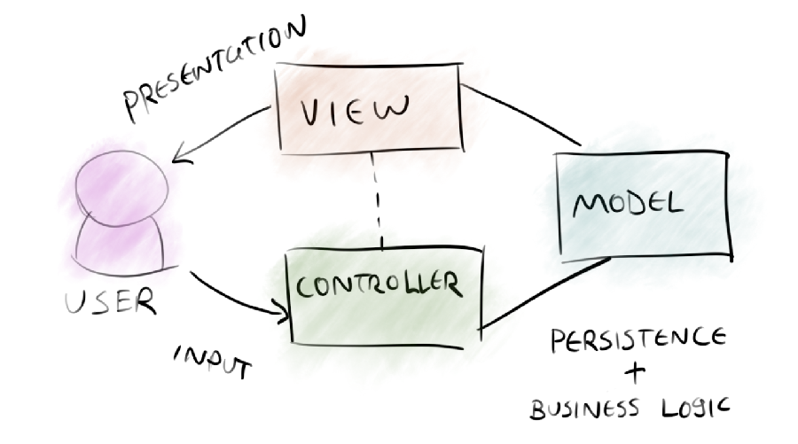
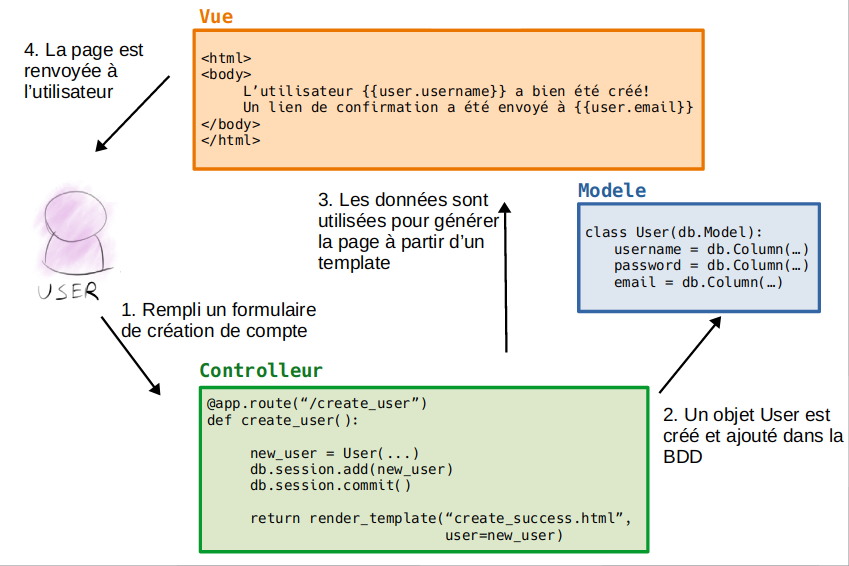

title: Python : introduction à Flask
class: animation-fade
layout: true

<!-- This slide will serve as the base layout for all your slides -->
<!--
.bottom-bar[
  {{title}}
]
-->

---

class: impact
# Introduction à Flask

---

# Une application web

- On interagit avec au travers d'un navigateur web
- Avec le navigateur, on accède à des ressources par des URL. Par exemple : 
    - La racine du site : `/`
    - Une page avec un formulaire de contact : `/contact`
    - Une image stockée sur le site : `/chat.jpg`
- On clique sur des liens qui vont demander d'autres ressources (GET)
- On clique sur des boutons qui peuvent envoyer des informations (POST)

---

# Une application web

## ... mais pourquoi une app web ? (plutôt qu'un logiciel classique)

Pros:

- Cross-platform
- Mise à jour simple
- Au niveau technique : distinction plus évidente entre le front et le back-end ?
- Plus de possibilité et de flexibilité cosmétiques

Cons:

- Moins de vie privée
- Le web est un désastre au niveau CPU


---

# L'architecture MVC

.center[

]

---

# L'architecture MVC

- **Modèle** = les données et la façon dont elles sont structurées...
- **Vue** = affichage, mise en forme des données
- **Controlleur** = la logique qui gère la requête de l'utilisateur, va chercher les données qu'il faut, et les donne à manger à la vue


---

# L'architecture MVC ... en exemple?

.center[

]

---

# Flask

## En quelques mots

Un "micro-framework" pour faire du web, composé de plusieurs morceaux
- Vues gérées avec **Jinja**  (moteur de template avec une syntaxe "à la Python")
- Controlleurs gérés avec **Werkzeug**  (une URL <-\> une fonction)
- Modèles gérées avec **SQLAlchemy**  (ORM : une classe <-\> une table SQL)

On peut y greffer pleins d'autres modules petits modules optionnels

Pour des applications plus grosses, on préferera tout même **Django** qui est un framework plus complet (mais plus complexe) mais qui suis la même logique

---

# Virtualenv

- Environnement virtuel
- Isoler des paquets / dépendances pour utiliser des versions spécifiques

```bash
# La premiere fois :
sudo apt install python-virtualenv python3-virtualenv

# Creation d'un virtualenv 'venv'
virtualenv -p python3 venv
source venv/bin/activate

# Installation de dependances
pip3 install <une dependance...>
pip3 install <une autre dependance...>


# On développe, on teste, etc....


# Si on a fini et/ou que l'on veut "sortir" du virtualenv
deactivate
```

---

# Virtualenv "de base" pour Flask

```python
virtualenv -p python3 venv
source venv/bin/activate

pip install Flask
pip install Flask-SQLAlchemy
```

---

# Hello World en Flask

#### On associe l'url `/` à un controlleur (= une fonction) qui renvoie `Hello World`

```python
from flask import Flask
app = Flask(__name__)

@app.route('/')
def hello_world():
    return 'Hello, World!'
```

Mon controlleur `hello_world()` doit renvoyer du texte ou une "HTTP response" (par exemple, erreur 404, ou redirection, ...)

---

# Hello World en Flask

Lancer le serveur web de test :

```bash
$ export FLASK_APP=hello.py
$ flask run
 * Running on http://127.0.0.1:5000/
```

ensuite, je visite: 
```
http://127.0.0.1:5000/     # -> Affichera 'Hello world'
```

---

# Hello World en Flask

#### On peut créer d'autres controlleur pour d'autres URLs...

```python
from flask import Flask
app = Flask(__name__)

@app.route('/')
def hello_world():
    return 'Hello, World!'

@app.route('/python')
def python():
    return "Le python, c'est la vie!"
```

ensuite : 
```
http://127.0.0.1:5000/python    # -> Affichera 'Le python, c'est la vie!'
```

---

# Créer des vues avec Jinja

Un template ressemble à :

```jinja
<html>
  Bonjour  !

  
    {{ app.name }} est niveau {{ app.level }} !
  
</html>
```

On peut l'*hydrater* avec par exemple ces données :

```python
prenom = "Alex"
apps = [ { "name": "mailman", "level": 2 },
         { "name": "wordpress", "level": 7 },
         { "name": "nextcloud", "level": 8 }    ]
```

---

# Créer des vues avec Jinja

Rendu : 

```
<html>
  Bonjour Alex !

  mailman est niveau 2 !
  wordpress est niveau 7 !
  nextcloud est de niveau 8 !
</html>
```

---

# Créer des vues avec Jinja

En supposant que le template précédent soit situé dans `templates/hello.html`, je peux utiliser `render_template` dans mon controlleur générer un rendu à l'aide de mes données

```python
from flask import render_template

@app.route('/')
def homepage():
    apps = [ { "name": "mailman", "level": 2 },
             { "name": "wordpress", "level": 7 },
             { "name": "nextcloud", "level": 8 }    ]
    return render_template('hello.html', 
                           name="Alex",
                           apps=apps)
```

---

# Gérer les données avec SQL Alchemy

```python
from flask_sqlalchemy import SQLAlchemy

app.config['SQLALCHEMY_DATABASE_URI'] = 'sqlite:///./db.sqlite'
db = SQLAlchemy()
db.init_app(app)


class App(db.Model):
    id = db.Column(db.Integer, primary_key=True)
    name = db.Column(db.String(80), unique=True, nullable=False)
    level = db.Column(db.Integer, nullable=False)
    date_last_test = db.Column(db.Date, nullable=True)
```

---

# Gérer les données avec SQL Alchemy

### Initialiser les tables

```python
# Supprimer toutes les tables existantes (achtung!)
db.drop_all()

# Recréer toutes les tables qui vont bien
db.create_all()
```


---

# Gérer les données avec SQL Alchemy

### Ecrire

```python
# Creer et ajouter une app dans la database...
mailman = App(name="mailman", level=3)
db.session.add(mailman)
db.session.commit()
```

### Lire

```python
# Trouver toutes les apps..
App.query.all()

# Trouver toutes les apps level 7 ...
App.query.filter_by(level=7).all()

# Trouver l'app qui s'apelle mailman
App.query.filter_by(name="mailman").first()
```

---

# Gérer les données avec SQL Alchemy

### Dans un controlleur

```python
from flask import render_template
from my_models import App

@app.route('/')
def homepage():

    apps = App.query.all()
    
    return render_template('hello.html', 
                           name="Alex",
                           apps=apps)
```

---

TP de mise en application : gestionnaire de contacts
