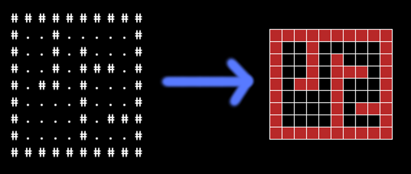
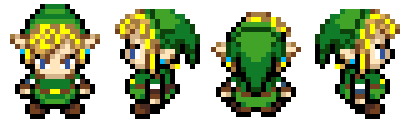

title: Python intermédiaire
class: animation-fade
layout: true

<!-- This slide will serve as the base layout for all your slides -->
<!--
.bottom-bar[
  {{title}}
]
-->

---

# 11. Pygame

## Une librairie pensée pour le jeu vidéo

* Afficher une fenêtre
* Dessiner des formes (lignes, rectangles, ...)
* Importer et afficher des images à des positions données
* Détecter les touches de clavier
* Détecter des collisions entre des objets
* ...

---

# 11. Pygame

## 11.1 Premier programme avec Pygame

```python
import pygame, sys
from pygame.locals import *
```

---

```python
# Initialiser pygame
pygame.init()

# Initialiser une fenêtre / l’écran de jeu
ecran = pygame.display.set_mode((400, 300))
pygame.display.set_caption('Mon jeu!')

# Boucle principale
while True:

    # Verifier si il y a des événement en attente
    for event in pygame.event.get():

        # Si l'utilisateur a déclenché la fermeture de la fenêtre
        if event.type == QUIT:
            # Désinitialiser pygame
            pygame.quit()
            # Sortir du programme
            sys.exit()
```

---

## 11.2 Changer la couleur de fond

Modification du programme (couleur = `(0,0,255)`)

```python
[...]

# Boucle principale
while True:

    # Remplir l'écran avec une couleur
    ecran.fill((0,0,255))

    for event in pygame.event.get():
        [...]

    # Rafraîchir l'écran
    pygame.display.update()
```

---

# 11. Pygame

## 11.3 Les surfaces

### Charger une image

```python
monImage = pygame.image.load("chaton.jpg").convert_alpha()
```

### **Blitter** : Coller une surface sur une autre

```python
surfaceDArrivee.blit(surface, (x,y))
```

---

### Charger et utiliser des images

```python
# Charger des images
fond = pygame.image.load("fond.png").convert()
image = pygame.image.load("image.png").convert_alpha()

# Boucle principale
while True:

    for event ...
        # [...]

    # Coller l'image de fond
    ecran.blit(fond, (0,0))

    # Coller l'autre image
    ecran.blit(image, (50,50))

    # [...]
```

---

# 11. Pygame

## 11.4 Les événements

Des événements sont générés en fonction des appuis des touches et des
mouvements / clics de la souris.

Par exemple, bouger la souris génère un événement `MOUSEMOTION`.

---


Déplacer une image avec le clavier
---------------------------------

```python
# Définir la position initiale de l'image
image_x = 20
image_y = 20

# Boucle principale
while True:

    # Verifier si il y a des événement en attente
    for event in pygame.event.get():

        if (event.type == pygame.KEYDOWN) :
            if (event.key == pygame.K_LEFT) :
                image_x -= 2
            if (event.key == pygame.K_RIGHT) :
                image_x += 2

    ecran.blit(image, (image_x,image_y))
```

---

## 12. Les classes

```python
class Monstre:

    def attaque(self, cible):
        cible.hp -= self.force

class Troll(Monstre):

    def __init__(self):
        self.hp = 20
        self.force = 4

    def vomir(self):
        print("Bleuarg!")

class Gobelin(Monstre):

    def __init__(self):
        self.hp = 5
        self.force = 1
```

---

## 12. Les classes

```python
# Initialiser des créatures

troll = Troll()
gob_army = [ Gobelin() for i in range(0,4) ]

# Faire une bataille !

print("Le troll a {n} hp".format(n=troll.hp))

troll.attaque(gob_army[0])
for gob in gob_army:
    gob.attaque(troll)

print("Le troll a {n} hp".format(n=troll.hp))
```

---

## 12. Les classes

### Elements syntaxiques importants : 

- L'indentation
- Le mot clef `class`
- `self` corresponds à l'instance / l'object (similaire à `this` dans d'autres
  langages)
- `__init__` corresponds au constructeur
- J'instancie un objet avec `NomDeClasse()` (eventuellement des arguments)

---


## 12. Les classes

### Appeler le constructeur de la classe mère...

```python
class Mere():
    
    def __init__(self):
        print("Je suis dans le constructeur de la classe mere !")

class Fille(Mere):

    def __init__(self):
        super().__init__()

```

---

# Construction d'un jeu tile-based

---


Elements de game building / design
----------------------------------

* **Afficher des choses** (écran, images, animations, texte)
* **Gérer les entrées** (clavier, souris, ...)
* Jouer des sons, de la musique
* **Penser l'architecture logicielle du jeu** (structures de données)
* **Penser la mécanique du jeu** (gameplay)
* Penser l'univers du jeu

Ref : http://lanyrd.com/2012/pycon/spbxc/

---

.center[
## Jeux tile-based

# 
]

---

.center[
## Jeux tile-based

# 
]

---

.center[
# Format de la map

# 
]

---

.center[
# Sprites

# 
]

---

# Les grandes étapes

### Le héros

1. Charger le sprite en mémoire
2. Afficher le héros sur l'écran
3. Ajouter une méthode `look` pour faire regarder le héros à
   droite/gauche/haut/bas
4. Ajouter une méthode `move` qui déplace le héros d'une case
5. Mapper les touches du clavier sur `look` et `move`

---

# Les grandes étapes

### La map

1. Lire le fichier ascii de la map vers une liste
2. Afficher la map

### Les collisions

1. Vérifier dans `move` si la case de destination est libre

